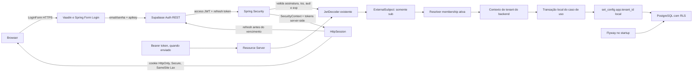

# Design da F-00 — Fundação técnica e acesso seguro

**Especificação:**
`.specs/features/f-00-foundation-access/spec.md`
**Status:** Aprovado
**Data:** 21 de setembro de 2026

## Visão da arquitetura

A F-00 será implementada dentro do monólito modular atual. O fluxo separa
autenticação, decisão de acesso, resolução de tenant, contexto transacional e
proteção do PostgreSQL. Nenhuma dessas responsabilidades fica na tela ou em
um `tenant_id` recebido do cliente.



O navegador não recebe access/refresh tokens. O mesmo conversor de identidade
continua atendendo o Resource Server para requisições Bearer, mas o fluxo
principal da UI Vaadin autentica pelo formulário server-side e mantém o
`SecurityContext` em uma sessão HTTP do servidor.

O runtime possui dois caminhos lógicos:

1. **Tenant Operations:** exige exatamente uma membership ativa, cria contexto
   de tenant e permite operações nos dados daquele tenant.
2. **Platform Administration:** exige a autoridade de plataforma e acessa
   somente metadados de plataforma. Não cria contexto de tenant para consultar
   dados operacionais.

A F-00 estabelece essas fronteiras. Os casos de uso concretos de criação de
tenant, convite e membership pertencem à F-01.

## Abordagem escolhida

### Contexto transacional explícito do tenant

Após o Spring Security validar o JWT e a aplicação resolver a membership ativa,
o limite transacional do caso de uso grava o tenant na conexão da transação:

```sql
select set_config('app.tenant_id', :tenant_id, true);
```

O terceiro argumento `true` faz com que o valor seja local à transação. As
policies RLS usam um acesso tolerante à ausência de configuração:

```sql
nullif(current_setting('app.tenant_id', true), '')::uuid
```

Uma linha sem `tenant_id` igual ao contexto não passa pela policy. A ausência
do contexto não seleciona um tenant padrão.

### Alternativas avaliadas

| Abordagem | Decisão | Motivo |
| --- | --- | --- |
| Contexto transacional `app.tenant_id` | **Adotada** | Mantém a aplicação como autoridade, limita o valor à transação e reduz o risco de vazamento em pool. |
| Contexto `app.user_id` com lookup de membership no RLS | Rejeitada para a V0 | Deixa as policies mais complexas e repete a resolução de membership por consulta protegida. |
| `auth.uid()` e claims Supabase como fonte do tenant | Rejeitada | Acopla o domínio de tenancy ao provedor de autenticação e não representa a decisão da aplicação. |

O desenho não usa `SET` de sessão sem escopo local, porque a conexão pode ser
reutilizada por outra transação. Também não usa `service_role`, superusuário ou
role com `BYPASSRLS` para as operações normais.

## Fluxos principais

### Inicialização

1. O Spring Boot carrega as configurações externas obrigatórias.
2. O Flyway conecta-se usando o contexto de migration configurado e executa as
   migrations pendentes em `classpath:db/migration`.
3. A aplicação valida que o datasource de runtime é utilizável e não depende
   de uma credencial que ignore RLS.
4. Se as etapas anteriores concluírem, o shell pode ser disponibilizado.
5. Se a configuração do banco ou uma migration falhar, o processo falha o
   startup; não há modo degradado para operar sem schema compatível.

### Autenticação e resolução de acesso

1. O `LoginForm` Vaadin envia e-mail e senha por HTTPS ao endpoint `/login` do
   Spring Security. Não há rota de cadastro público ou de recuperação de senha.
2. O `AuthenticationProvider` chama o endpoint de password sign-in do Supabase
   Auth REST com o header `apikey`; não chama o endpoint administrativo nem usa
   `service_role`.
3. O backend valida o access JWT retornado com o `JwtDecoder` existente
   (assinatura ES256/JWKS, issuer, audience e expiração) e confirma que o `sub`
   corresponde ao usuário retornado pelo Auth. Erros de credencial têm mensagem
   genérica.
4. Spring Security salva o principal `ExternalSubject` e o par de tokens na
   sessão HTTP server-side. O cookie é HttpOnly, Secure no ambiente publicado
   HTTPS e SameSite Lax; a sessão expira após 30 minutos de inatividade.
5. O refresh filter sincroniza por sessão. Próximo do vencimento, troca o
   refresh token por um novo par, valida o JWT e substitui o par inteiro antes
   de permitir a request. Se o refresh falhar, somente um access token ainda
   válido pode ser usado; token vencido encerra a sessão e exige novo login.
6. O logout invalida a sessão Spring local e solicita ao Supabase logout com
   escopo `local`; falha remota não preserva a sessão local.
7. O Resource Server continua validando requests Bearer com as mesmas regras,
   quando esse contrato é usado fora do formulário Vaadin.
8. O adaptador extrai somente o `sub` como identificador externo. Claims de
   tenant, `user_metadata` e o claim `role` do Supabase não substituem a
   autorização do domínio.
9. O resolver procura a identidade e sua membership. Uma membership ativa
   produz um `TenantAccessContext`; nenhuma membership ou mais de uma bloqueia
   a operação de tenant.
10. Uma autoridade de plataforma pode acessar o contexto administrativo sem
   receber contexto operacional de tenant.

### Operação tenant-scoped

1. O caso de uso recebe um contexto de acesso já resolvido; não recebe o
   `tenant_id` como autoridade do comando.
2. O limite transacional inicia a transação local.
3. O adaptador de RLS adquire a conexão vinculada à transação e executa
   `set_config(..., true)` nessa mesma conexão.
4. Repositórios executam leituras e escritas normalmente. O filtro da
   aplicação e a policy RLS protegem os dados.
5. Commit confirma todos os efeitos locais; qualquer falha provoca rollback.
6. Ao concluir a transação, o valor local deixa de existir. Nenhuma limpeza
   manual de estado de sessão é necessária como mecanismo primário.

### Operação de plataforma

Operações de `PLATFORM_ADMIN` usam somente repositórios do schema de plataforma
e não estabelecem `app.tenant_id`. O desenho não autoriza que uma tela de
plataforma consulte tabelas operacionais para obter dados de clientes.

## Organização dos módulos

Os pacotes abaixo são a proposta de fronteira inicial. Eles não criam módulos
Maven separados; a separação é aplicada no monólito por dependência de pacotes,
casos de uso e regras de autorização.

```text
br.com.taas.saas.gestaoproducao
├── platform
│   ├── identity       # identidade externa, membership e papéis mínimos
│   ├── access         # autenticação, autorização e decisão de acesso
│   └── bootstrap      # verificações de startup e integração com Flyway
├── tenancy
│   ├── model          # TenantId e TenantAccessContext
│   └── application    # resolução e propagação do contexto
├── persistence
│   └── rls            # escrita do contexto na conexão transacional
└── ui
    └── access         # shell, login e estados de acesso
```

Os pacotes `platform` não importam entidades ou casos de uso de `operations`.
As features seguintes adicionarão seus próprios pacotes operacionais sem mover
a resolução de tenant para dentro das telas.

### Direção de dependências e CQRS lógico

Casos de uso e políticas de domínio dependem de portas que representam suas
necessidades. Adapters de autenticação, persistência, JDBC e RLS implementam
essas portas; a configuração Spring faz a composição no limite da aplicação.
Não haverá dependência direta de JPA, JDBC ou detalhes do Supabase dentro dos
casos de uso.

A camada de aplicação separará commands e queries por intenção. Commands
alteram o domínio dentro da fronteira ACID do caso de uso. Queries consultam
modelos ou projeções de leitura sem mutação. A separação é lógica e síncrona,
no mesmo monólito e PostgreSQL, sem mensageria, event sourcing ou banco de
leitura separado na V0. As duas categorias continuam sujeitas à resolução de
tenant e ao RLS.

## Componentes e interfaces

### Resource Server e conversor de identidade

- **Propósito:** validar JWTs emitidos pelo Supabase e construir uma identidade
  mínima para a aplicação.
- **Localização:** `platform/access/security`.
- **Interface principal:**
  converter de `Jwt` para token autenticado cujo principal é `ExternalSubject`.
- **Dependências:** Spring Security Resource Server, issuer/JWKS do Supabase e
  configurações externas.
- **Projeto V0:** o Supabase usa ECC P-256 (`ES256`). O issuer é
  `https://clcgyhsjbenywugcagjo.supabase.co/auth/v1` e o JWKS é obtido em
  `/auth/v1/.well-known/jwks.json` com o header `apikey` usando a chave
  publicável ativa do projeto.
- **Regra:** o conversor usa o `sub` como identificador externo; não usa
  `user_metadata` nem transforma automaticamente claims do provedor em
  permissões de domínio.

### Login Supabase e sessão Vaadin

- **Propósito:** autenticar uma conta Supabase existente e estabelecer a sessão
  protegida da UI Vaadin sem transportar tokens ao navegador.
- **Localização:** `platform/access/security` e `ui/access`.
- **Interfaces:** `LoginForm` publica o POST de formulário esperado pelo
  `VaadinSecurityConfigurer`; um `AuthenticationProvider` delega ao cliente
  Supabase Auth e retorna o `SupabaseAuthenticationToken` existente.
- **Integração:** reaproveita o `RestOperations` com timeout de dois segundos
  e header `apikey`; o endpoint base deriva do issuer Supabase já configurado.
  O `JwtDecoder` e o conversor atuais validam/mapam o token.
- **Sessão:** Spring Security persiste o contexto HTTP; access e refresh tokens
  ficam no `SupabaseAuthenticationToken` da sessão do servidor. O cookie tem
  timeout ocioso de 30 minutos, HttpOnly, Secure em produção e SameSite Lax.
- **Refresh:** filtro depois da autenticação Bearer inspeciona apenas sessões
  com refresh token. Ele sincroniza no `HttpSession`, recarrega o contexto mais
  recente e salva o par rotacionado por `SecurityContextRepository`.
- **Logout:** o logout Vaadin usa um `LogoutHandler` que pede ao Supabase o
  encerramento de escopo local e deixa Spring invalidar a sessão mesmo se a
  chamada remota falhar.
- **Limite:** não implementa cadastro, recuperação de senha, login social,
  armazenamento externo de sessão ou novos papéis/claims.

### Resolver de membership

- **Propósito:** converter uma identidade autenticada em uma decisão de acesso
  do domínio.
- **Localização:** `platform/access/application`.
- **Interface principal:**
  `AccessDecision resolve(ExternalSubject subject)`.
- **Dependências:** repositório de identidade, membership e tenant.
- **Resultados:** `TENANT_ACCESS`, `PLATFORM_ACCESS`, `NOT_PROVISIONED` ou
  `AMBIGUOUS_MEMBERSHIP`.

### Contexto de acesso

- **Propósito:** transportar somente a decisão confiável de acesso para o
  limite do caso de uso.
- **Localização:** `tenancy/model`.
- **Dados:** identificador externo, identidade de domínio, tenant resolvido,
  autoridade mínima e origem do contexto.
- **Regra:** o objeto não pode ser criado a partir de um `tenant_id` recebido
  diretamente do cliente.

### Propagador de contexto RLS

- **Propósito:** gravar o tenant na conexão da transação atual.
- **Localização:** `persistence/rls`.
- **Interface principal:**
  `void apply(TenantId tenantId, Connection connection)`.
- **Dependências:** datasource transacional e JDBC.
- **Regra:** falhar se não houver transação/conexão vinculada; nunca abrir uma
  conexão independente para gravar o contexto.

### Limite transacional de caso de uso

- **Propósito:** garantir que o contexto RLS e as alterações do domínio
  compartilhem a mesma transação local.
- **Localização:** `tenancy/application` e configuração transversal de
  transações.
- **Interface principal:**
  `R execute(TenantAccessContext context, UseCase<R> useCase)`.
- **Dependências:** Spring transaction management, propagador RLS e casos de
  uso.
- **Regra:** chamadas externas ou efeitos fora do PostgreSQL não ficam dentro
  da transação local sem uma decisão específica da feature.

### Repositórios de plataforma

- **Propósito:** consultar identidade, tenant e membership sem misturar essas
  consultas com repositórios operacionais.
- **Localização:** `platform/identity/persistence`.
- **Interfaces:**
  `findByProviderAndExternalSubject(...)`,
  `findActiveMembershipsByIdentity(...)` e
  `findTenantById(...)`.
- **Dependências:** Spring Data JPA/Hibernate e schema de plataforma.
- **Regra:** membership ambígua é resultado de erro de configuração, não motivo
  para selecionar o primeiro registro.

### Shell de acesso

- **Propósito:** apresentar autenticação, estado de provisionamento e entrada
  para a aplicação sem antecipar a operação de negócio.
- **Localização:** `ui/access`.
- **Dependências:** Vaadin e decisão de acesso já resolvida.
- **Regra:** o shell não acessa diretamente repositórios nem decide tenant.

## Modelo de dados

### Identidade externa

Representa a fronteira entre o provedor de autenticação e o domínio:

| Campo | Regra |
| --- | --- |
| `id` | UUID interno, chave do domínio. |
| `provider` | Valor controlado, inicialmente `SUPABASE`. |
| `external_subject` | Valor do claim `sub`; único dentro do provider. |
| `status` | Ativa ou bloqueada. |
| `created_at` | Timestamp de criação do vínculo local. |

O domínio não persiste senha, refresh token ou segredo do Supabase. O refresh
token existe apenas no contexto de segurança da sessão HTTP server-side e não é
gravado no PostgreSQL.

### Tenant

Metadado de plataforma usado para identificar a organização isolada:

| Campo | Regra |
| --- | --- |
| `id` | UUID estável usado nas FKs e no contexto RLS. |
| `status` | Ativo, suspenso ou encerrado conforme o provisionamento. |
| `created_at` | Timestamp de criação. |

A criação e o ciclo de vida operacional pertencem à F-01.

### Membership

Vínculo de uma identidade com um tenant:

| Campo | Regra |
| --- | --- |
| `id` | UUID interno. |
| `identity_id` | FK para a identidade externa. |
| `tenant_id` | FK para o tenant. |
| `status` | Ativa, revogada ou pendente conforme F-01. |
| `role` | Papel mínimo necessário para a fronteira de acesso. |
| `created_at` e `revoked_at` | Rastreabilidade do vínculo. |

Uma restrição de unicidade parcial deve impedir mais de uma membership ativa
por identidade na operação normal. O resolver continua tratando duplicidade
existente como bloqueio defensivo.

### Contexto em memória

`TenantAccessContext` não é uma entidade persistida. Ele contém o resultado
confiável da resolução atual e vive somente durante a requisição/caso de uso.
Seu `tenant_id` é a única entrada permitida para o escritor do GUC RLS.

### Tabela tenant-scoped de fundação

A primeira migration deve criar uma tabela pequena de configuração do tenant em
`operations.tenant_settings`. Ela fornece uma âncora real para validar RLS e
poderá receber as configurações de planejamento da V0 em uma migration
posterior. A F-00 não cria tela nem regra de negócio para esses campos.

Essa tabela não é um fixture exclusivo de teste. Os testes de isolamento usam
uma tabela que permanece no modelo de domínio e evolui com as features
seguintes.

## Banco, roles e RLS

### Schemas

- `platform`: identidade externa, tenant, membership e metadados de
  provisionamento.
- `operations`: tabelas pertencentes ao tenant e protegidas por RLS.

Os schemas, grants, constraints, índices, RLS e políticas devem ser criados por
migration Flyway. O histórico não será mantido pelo Supabase CLI.

### Credenciais

- **Migration credential:** pode criar/alterar schemas, tabelas, grants e
  policies; é usada exclusivamente pelo Flyway durante startup ou operação
  controlada.
- **Runtime credential:** executa a aplicação; não possui `BYPASSRLS`, não é
  superuser, não é `service_role` e não é owner das tabelas tenant-scoped.

Se o provedor gerenciado não permitir essa separação no plano da V0, a
execução fica bloqueada até uma alternativa comprovada com PostgreSQL real. Não
será considerado suficiente apenas adicionar filtros na aplicação.

### Policies tenant-scoped

Para cada tabela de `operations`:

1. habilitar RLS e, quando a role proprietária puder ignorar policies, forçar
   RLS conforme a estratégia de role validada;
2. conceder ao runtime somente os privilégios necessários;
3. criar policies explícitas para `SELECT`, `INSERT`, `UPDATE` e `DELETE`;
4. usar `USING` para linhas existentes e `WITH CHECK` para o estado resultante
   em operações de escrita;
5. comparar `tenant_id` com o GUC transacional, tratando ausência como negação;
6. criar testes de permissão e de isolamento para cada tabela protegida.

O backend não usará `auth.uid()` como substituto do contexto, porque o acesso
ao PostgreSQL ocorre pelo datasource da aplicação e o vínculo usuário–tenant é
responsabilidade do domínio.

## Inicialização e migrations

O Spring Boot deve usar o starter Flyway e o módulo específico do PostgreSQL.
As migrations SQL ficam em `src/main/resources/db/migration` com o padrão
`V<VERSION>__<NAME>.sql`. A primeira migration da F-00 deve conter somente o
fundamento necessário para a F-00; a evolução das features adicionará novas
migrations.

Cada migration que puder ser revertida terá um script de reversão revisado no
diretório de procedimento definido pelo projeto. O Flyway Community não será
tratado como se possuísse o comando `undo` do Teams.

Falha de migration ou de configuração obrigatória impede o startup considerado
bem-sucedido. Não haverá execução manual concorrente de migration pela
aplicação fora do Flyway.

## Estratégia de testes

### Unitários

- conversão de `sub` em `ExternalSubject`;
- decisão para zero, uma e múltiplas memberships ativas;
- bloqueio de status revogado/inativo;
- rejeição de contexto construído a partir de tenant fornecido pelo cliente;
- construção de mensagem segura para usuário não provisionado.

### Integração com PostgreSQL real

- aplicação das migrations desde banco vazio;
- startup com schema atualizado sem reaplicar migration;
- falha de migration impedindo startup;
- leitura permitida no tenant correto;
- leitura sem contexto negada;
- leitura e escrita entre tenants negadas;
- `UPDATE` protegido por `USING` e `WITH CHECK`;
- contexto anterior não sobrevivendo ao reuso da conexão;
- rollback de operação composta sem alteração parcial;
- runtime role sem `BYPASSRLS` e sem uso de `service_role`.

Os testes RLS devem usar PostgreSQL real. H2 ou outro banco em memória não é
aceitável para validar policy, role, grants ou comportamento de conexão.

### Integração de autenticação

- token válido com issuer e assinatura esperados;
- token expirado, issuer incorreto ou assinatura inválida;
- token sem `sub` utilizável;
- rotação do JWKS conforme a política de cache configurada;
- nenhuma decisão de tenant baseada em `user_metadata` ou em claim enviado
  pelo cliente.

### Interface

- shell para usuário não autenticado;
- shell para usuário sem membership;
- shell para vínculo ambíguo;
- shell para usuário provisionado;
- ausência de dados operacionais em todos os estados bloqueados.

## Tratamento de erros

| Situação | Tratamento interno | Experiência do usuário |
| --- | --- | --- |
| JWT inválido ou expirado | Spring Security rejeita antes do domínio. | Login necessário ou sessão expirada. |
| Nenhuma membership ativa | `NOT_PROVISIONED`. | Acesso não provisionado; nenhuma operação disponível. |
| Múltiplas memberships ativas | `AMBIGUOUS_MEMBERSHIP` e log sem dados sensíveis. | Acesso temporariamente bloqueado; suporte administrativo deve corrigir o vínculo. |
| Tenant suspenso | Decisão de acesso negativa. | Acesso operacional bloqueado. |
| Tenant ausente no contexto | Falha fechada antes da consulta ou bloqueio pelo RLS. | Erro genérico; nenhum dado é retornado. |
| RLS nega operação | Não tentar novamente com role privilegiada. | Erro genérico e registro técnico correlacionável. |
| Migration falha | Propagar falha de startup. | Aplicação indisponível até correção. |
| Falha parcial do caso de uso | Rollback da transação local. | Operação não confirmada; nenhum estado parcial. |

## Reutilização do código existente

| Componente existente | Localização | Uso |
| --- | --- | --- |
| Classe de bootstrap | `src/main/java/br/com/taas/saas/gestaoproducao/GestaoProducaoApplication.java` | Manter como entrypoint do Spring Boot. |
| Configuração YAML | `src/main/resources/application.yaml` | Evoluir com propriedades externas da fundação, sem segredos versionados. |
| Teste de contexto | `src/test/java/br/com/taas/saas/gestaoproducao/GestaoProducaoApplicationTests.java` | Preservar como teste mínimo e separar testes de integração da fundação. |
| `pom.xml` | raiz do projeto | Adicionar somente starters e módulos necessários, com versões gerenciadas pelo Spring Boot. |

Não há implementação de autenticação, persistência, RLS, Vaadin ou Flyway a
reutilizar no estado atual.

## Riscos e preocupações

| Preocupação | Impacto | Mitigação |
| --- | --- | --- |
| Role do runtime ignora RLS | A segunda barreira seria falsa. | Validar `NOBYPASSRLS`, evitar superuser/owner e testar com PostgreSQL real; bloquear a execução se não for possível. |
| Contexto gravado na conexão errada | Pode negar acesso válido ou expor outro tenant em caso de `SET` de sessão. | `set_config(..., true)` depois do início da transação, adapter baseado na conexão transacional e teste de reuso de pool. |
| JWKS protegido por API key | A descoberta automática pode falhar se o cliente não enviar o header exigido. | Usar um cliente JWKS configurado com a chave publicável ativa; validar `iss`, `exp`, assinatura e `kid` sem usar segredo JWT. |
| Renovação concorrente de refresh token de uso único | Requests simultâneas poderiam reutilizar o token anterior e revogar a sessão. | Serializar refresh por `HttpSession`, recarregar o `SecurityContext` depois do lock e salvar juntos o novo access/refresh token. |
| Sessão perdida em restart/cold start | Usuário precisa se autenticar de novo no Render gratuito. | Aceito para o MVP single-instance; não adicionar armazenamento pago/externo de sessão nesta V0. |
| Credenciais e tokens em logs ou navegador | Vazamento poderia permitir takeover de uma sessão. | Usar somente POST HTTPS, nunca registrar payloads, manter tokens no servidor e configurar cookie HttpOnly/Secure/SameSite. |
| Membership consultada antes do tenant context | A consulta pode ser inadvertidamente protegida por policy inadequada. | Manter metadados em schema de plataforma com grants explícitos e separar repositórios de plataforma dos operacionais. |
| Migrations no startup em múltiplas instâncias | Instâncias podem disputar o início durante evolução futura. | V0 aceita o trade-off; deployment futuro deve revisar ADR-022 antes de escalar horizontalmente. |
| Testes apenas com H2 | RLS, roles e GUCs podem parecer corretos e falhar no PostgreSQL. | Testes de integração obrigatórios em PostgreSQL real. |

## Decisões técnicas

| Decisão | Escolha | Justificativa |
| --- | --- | --- |
| Modo de execução | Monólito modular | Está definido no baseline e mantém a V0 simples. |
| Login da UI Vaadin | Spring Security form login + Supabase Auth password REST + sessão HttpSession server-side | Completa o formulário e mantém tokens fora do browser, preservando o domínio independente do provedor. |
| Requests Bearer | Spring Security Resource Server com JWT Supabase | Mantém o contrato Resource Server existente sem utilizá-lo como sessão principal do Vaadin. |
| Renovação de sessão | Refresh token Supabase rotacionado sob lock por sessão | Cumpre a renovação de tokens de uso único sem dependência Java adicional ou armazenamento pago. |
| Chave de validação JWT | ES256 com JWKS do Supabase e header `apikey` na leitura | Evita armazenar segredo JWT, permite rotação por chaves públicas e mantém a validação local no backend. |
| Contexto de tenant | GUC PostgreSQL local à transação | É a abordagem aprovada e evita vazamento por pool. |
| Isolamento | Filtro de aplicação + PostgreSQL RLS | Defesa em profundidade exigida pelos ADRs. |
| Migration | Flyway no startup | É o executor único definido nos ADRs. |
| Transação | Spring local + PostgreSQL ACID | Não há JTA ou serviço externo transacional na V0. |
| Teste de banco | PostgreSQL real | H2 não representa RLS, grants, roles ou GUCs. |
| Dependência | Portas internas e adapters de infraestrutura | Mantém domínio e aplicação independentes de JPA, JDBC e provedores. |
| Organização de casos de uso | CQRS lógico e síncrono | Separa mutações e leituras sem introduzir infraestrutura distribuída. |

## Referências oficiais consultadas

- [Spring Security — Resource Server JWT](https://docs.spring.io/spring-security/reference/servlet/oauth2/resource-server/jwt.html)
- [Spring Security 7.1.1 — Authentication persistence and session management](https://docs.spring.io/spring-security/reference/7.1/servlet/authentication/session-management.html)
- [Vaadin — Security and form login](https://vaadin.com/docs/latest/flow/security/enabling-security)
- [Supabase — Password-based Auth](https://supabase.com/docs/guides/auth/passwords)
- [Supabase — Auth server password/refresh endpoints](https://supabase.com/docs/reference/self-hosting-auth)
- [Supabase — User sessions and refresh rotation](https://supabase.com/docs/guides/auth/sessions)
- [Supabase — Local sign out](https://supabase.com/docs/guides/auth/signout)
- [Spring Framework — Dependency Injection](https://docs.spring.io/spring-framework/reference/core/beans/dependencies/factory-collaborators.html)
- [Spring Framework — Transaction Management](https://docs.spring.io/spring-framework/reference/data-access/transaction.html)
- [Spring Boot — Database Initialization e Flyway](https://docs.spring.io/spring-boot/how-to/data-initialization.html)
- [Supabase — Row Level Security](https://supabase.com/docs/guides/database/postgres/row-level-security)
- [Supabase — JWT Signing Keys](https://supabase.com/docs/guides/auth/signing-keys)
- [Supabase — JSON Web Token](https://supabase.com/docs/guides/auth/jwts)
- [PostgreSQL — System Administration Functions](https://www.postgresql.org/docs/current/functions-admin.html)
- [PostgreSQL — CREATE ROLE](https://www.postgresql.org/docs/current/sql-createrole.html)
- [PostgreSQL — CREATE POLICY](https://www.postgresql.org/docs/current/sql-createpolicy.html)

## Critério para avançar para Tasks

O design está pronto para decomposição quando:

- o usuário confirmar a arquitetura documentada;
- o plano de role de runtime e migration for validado contra o PostgreSQL
  gerenciado escolhido;
- o modo de assinatura JWT do projeto Supabase for confirmado;
- cada risco bloqueador tiver uma tarefa de validação antes da implementação
  dependente;
- a matriz de testes da F-00 for transformada em tarefas atômicas.
