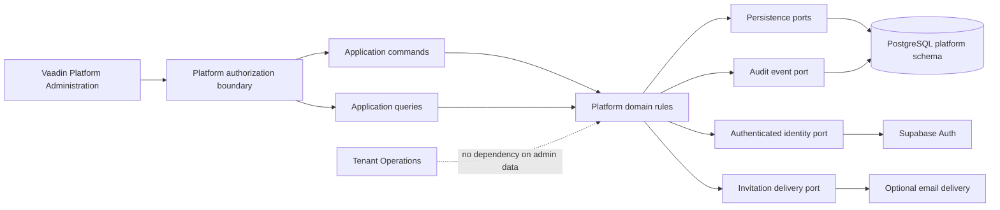
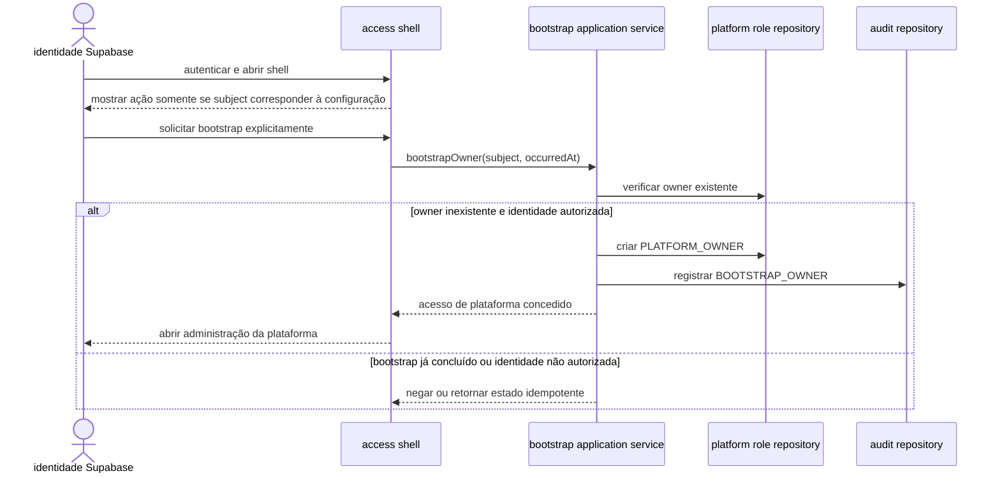
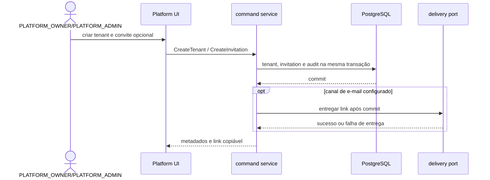
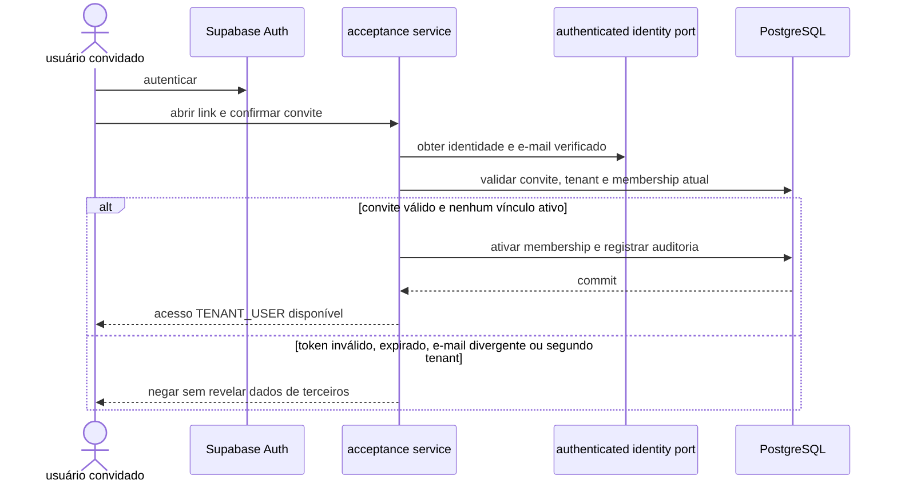

# F-01 — Design de provisionamento da plataforma

**Spec:** `.specs/features/f-01-platform-provisioning/spec.md`
**Contexto:** `.specs/features/f-01-platform-provisioning/context.md`
**Status:** Baseline implementada; desenho de fechamento pendente para T18–T23, sem alteração dos limites de domínio da V0.

## Abordagem selecionada

A F-01 usará o domínio próprio como fonte de verdade para tenants, papéis de
plataforma, convites, memberships e auditoria. O Supabase Auth continuará
responsável por autenticar a identidade, mas não será a autoridade do ciclo de
vida do tenant ou da membership.

O desenho separa três responsabilidades:

1. **Domínio e aplicação:** aplicam regras de negócio, autorização contextual,
   transações locais e auditoria.
2. **Persistência:** mantém o estado da plataforma no schema `platform`, por
   migrations Flyway e adapters JPA.
3. **Integrações externas:** consultam a identidade autenticada e entregam o
   convite por portas de saída; nenhuma chamada externa é a fonte da verdade
   transacional.

Essa abordagem preserva o limite entre Platform Administration e Tenant
Operations do ADR-015, mantém a inversão de dependência do ADR-023 e evita que
uma chamada de e-mail ou Supabase seja tratada como parte de uma transação ACID
local.

## Visão arquitetural

Platform Administration e Tenant Operations permanecem módulos irmãos. A
administração pode consultar metadados de tenant necessários ao provisionamento,
mas não importa repositórios nem casos de uso de pedidos, estoque, produção,
custos ou indicadores.

## Fluxos principais

### Bootstrap do owner

O bootstrap é uma operação controlada, idempotente e limitada a um owner. A
identidade autorizada deve vir de configuração de ambiente ou procedimento
equivalente fora do código; nenhum e-mail, UUID ou segredo é hardcoded. O shell
mostra a ação somente quando o `ExternalSubject` autenticado corresponde ao
`platform.bootstrap.owner-subject`. A aplicação não inicia o bootstrap
automaticamente no login; o serviço revalida a identidade no momento da ação.

### Criação de tenant e convite

A criação do convite e a auditoria são confirmadas antes de tentar e-mail. A
falha do canal externo não desfaz o tenant ou o convite.

### Aceitação do convite

## Limites dos módulos

### `platform.administration`

- **Responsabilidade:** casos de uso de bootstrap, tenants, convites, papéis de
  plataforma, memberships e auditoria.
- **Pode depender de:** modelos de identidade, portas de persistência e portas
  de integração externa.
- **Não pode depender de:** repositórios ou entidades de `operations`.

### `platform.identity`

- **Responsabilidade:** identidade externa, atribuição de papéis de plataforma,
  convite, membership e regras de transição relacionadas ao acesso.
- **Reuso:** `ExternalSubject`, `Tenant`, `Membership`, estados e ports da F-00
  devem ser evoluídos sem trocar a identidade externa por claims editáveis.

### `ui.platform`

- **Responsabilidade:** telas Vaadin para tenants, convites, memberships,
  papéis administrativos e auditoria.
- **Regra:** a UI chama casos de uso; não consulta `JdbcTemplate`, JPA ou
  Supabase diretamente.

### `tenant operations`

- **Responsabilidade:** permanece fora da implementação da F-01.
- **Regra:** só recebe acesso quando a F-00 resolver uma membership operacional
  ativa; papel de plataforma não cria contexto de tenant.

## Análise de reuso

| Componente existente | Localização | Uso no design |
| --- | --- | --- |
| Identidade externa | `platform/identity/model/ExternalIdentity.java` | Reutilizar o `ExternalSubject` e o identificador interno; não usar `user_metadata`. |
| Tenant e membership | `platform/identity/model/` | Evoluir estados e regras sem misturar papel de plataforma com tenant. |
| Repositórios de saída | `platform/identity/application/port/out/` | Estender por portas específicas para role assignment, convite, tenant e auditoria. |
| Decisão de acesso | `platform/access/application/AccessDecisionResolver.java` | Trocar a leitura de `PLATFORM_ADMIN` em membership pela consulta de papel de plataforma. |
| Segurança JWT | `platform/access/security/` | Reutilizar o JWT validado e o `ExternalSubject`; a confirmação de e-mail será uma fronteira adicional. |
| Transação de tenant | `tenancy/application/TenantScopedTransactionExecutor.java` | Não usar para Platform Administration; criar limite transacional próprio sem contexto RLS de tenant. |
| RLS e migrations | `persistence/rls/` e `db/migration/` | Manter `platform` como metadado administrativo e evoluir por Flyway. |
| Shell Vaadin | `ui/access/` | Reutilizar a decisão de acesso e acrescentar navegação para Platform Administration. |

## Componentes e interfaces

### `PlatformRoleAssignment`

- **Propósito:** representar `PLATFORM_OWNER` ou `PLATFORM_ADMIN` sem
  `tenant_id`.
- **Local:** `platform/identity/model/`.
- **Regras:** owner único, estado ativo/revogado e impossibilidade de criar um
  segundo owner.

### `PlatformRoleRepository`

- **Propósito:** buscar e persistir atribuições de papel de plataforma.
- **Porta:** `findActiveByIdentityId(IdentityId)`,
  `findActiveOwner()`, `save(PlatformRoleAssignment)` e
  `revoke(PlatformRoleAssignmentId, RevocationReason)`.
- **Adapter:** JPA no schema `platform`.

### `PlatformProvisioningCommandService`

- **Propósito:** executar comandos de bootstrap, tenant, convite, membership e
  papel administrativo.
- **Interfaces lógicas:**
  - `bootstrapOwner(AuthenticatedPlatformActor)`;
  - `createTenant(CreateTenantCommand)`;
  - `changeTenantStatus(ChangeTenantStatusCommand)`;
  - `createInvitation(CreateInvitationCommand)`;
  - `resendInvitation(InvitationId)`;
  - `revokeInvitation(InvitationId)`;
  - `acceptInvitation(AcceptInvitationCommand)`;
  - `revokeMembership(MembershipId)`;
  - `grantPlatformAdmin(ExternalSubject)`;
  - `revokePlatformAdmin(PlatformRoleAssignmentId)`.
- **Dependências:** portas de domínio, autorização, persistência, identidade
  externa e auditoria.

### `PlatformProvisioningQueryService`

- **Propósito:** consultar tenants, convites, memberships, papéis e auditoria
  administrativa.
- **Regra:** queries retornam somente DTOs de plataforma; não carregam dados de
  `operations`.

### `AuthenticatedIdentityPort`

- **Propósito:** obter o e-mail e o estado de verificação da identidade
  autenticada a partir do token já validado.
- **Contrato:** `loadVerifiedProfile(AccessTokenContext)` retorna subject,
  e-mail normalizado e `emailVerified`, ou falha segura.
- **Adapter:** chamada oficial ao Auth server do Supabase ou adapter
  equivalente validado no T7; nunca usar `user_metadata` para autorização.

### `InvitationDeliveryPort`

- **Propósito:** entregar um link de convite depois do commit local.
- **Contrato:** `deliver(InvitationDeliveryRequest)` retorna sucesso ou falha
  de entrega sem alterar o estado principal do convite.
- **Implementações:** link copiável é sempre produzido; e-mail é um adapter
  opcional habilitado apenas quando configurado.

### `AdministrativeAuditPort`

- **Propósito:** registrar e consultar ações administrativas sem dados
  operacionais.
- **Contrato:** `record(AuditEvent)` e queries paginadas por alvo, ator, ação e
  período.
- **Regra:** evento de mutação confirmado fica na mesma transação da mudança;
  falha de validação registra resultado apenas quando o desenho confirmar que a
  tentativa não expõe dados sensíveis.

### `PlatformAuthorizationService`

- **Propósito:** resolver se a identidade possui `PLATFORM_OWNER` ou
  `PLATFORM_ADMIN` e aplicar a hierarquia.
- **Regra:** autorização deve existir no caso de uso, além da proteção da rota
  e da UI. O owner pode gerir administradores e ciclo de vida; o admin comum
  não pode gerir papéis de plataforma.

## Modelo de dados lógico

### `platform.platform_role_assignment`

| Campo | Regra |
| --- | --- |
| `id` | Identificador interno UUID. |
| `identity_id` | FK para `platform.external_identity`. |
| `role` | `PLATFORM_OWNER` ou `PLATFORM_ADMIN`. |
| `status` | `ACTIVE` ou `REVOKED`. |
| `created_at` / `revoked_at` | Ciclo de vida e rastreabilidade. |

Constraints: no máximo um owner ativo e no máximo uma atribuição ativa do mesmo
papel para a mesma identidade.

### `platform.tenant`

O schema existente será evoluído com o nome de apresentação e os metadados
necessários às transições de estado. O identificador UUID continua sendo a
referência estável; nenhum slug público ou dado comercial é necessário na F-01.

### `platform.invitation`

| Campo | Regra |
| --- | --- |
| `id` | Identificador interno UUID. |
| `tenant_id` | FK para tenant; não nulo. |
| `email` | Destinatário normalizado, limitado ao necessário para provisionamento. |
| `role` | Somente `TENANT_USER` na V0. |
| `status` | `PENDING`, `ACCEPTED`, `REVOKED` ou `EXPIRED`. |
| `token_digest` | Digest do token; o token em claro não é persistido. |
| `identity_id` | Opcional até associação/aceitação. |
| `expires_at` | Criado para 24 horas após a emissão. |
| `accepted_at` / `revoked_at` | Preenchidos conforme a transição. |
| `created_by` / `created_at` | Ator e momento da criação. |

Constraint de negócio: um convite `PENDING` por `(tenant_id, email_normalized)`.

### `platform.audit_event`

| Campo | Regra |
| --- | --- |
| `id` | UUID. |
| `actor_identity_id` | Identidade que executou a ação, quando houver. |
| `action` | Vocabulário fechado da F-01. |
| `target_type` / `target_id` | Tenant, convite, membership ou papel. |
| `result` | `SUCCESS` ou `DENIED/FAILED` conforme o contrato definido. |
| `occurred_at` | Momento do evento. |
| `metadata` | Somente metadados administrativos mínimos, sem token ou dados operacionais. |

## Autorização e transações

- Rotas de Platform Administration exigem autenticação e papel de plataforma.
- Casos de uso repetem a autorização para impedir bypass por chamada interna,
  teste ou futura rota.
- Atribuições de plataforma não recebem `TenantAccessContext` nem chamam o
  escritor de RLS de operações.
- Mutação local de tenant, convite, membership, papel e auditoria usa uma
  transação ACID do PostgreSQL.
- A entrega de e-mail ocorre somente depois do commit. A chamada externa nunca
  fica dentro da transação que grava o estado principal.
- A aceitação do convite valida expiração, tenant, e-mail verificado,
  membership atual e estado do tenant antes de alterar o vínculo.
- A aceitação serializa concorrentes pelo convite pendente e mantém a
  constraint de uma membership ativa por identidade como barreira final. A
  alteração de identidade, membership, convite e auditoria ocorre na mesma
  transação local.
- O desenho não adiciona JTA, mensageria, outbox, banco de leitura ou
  microserviço.

## Estratégia de erros

| Cenário | Tratamento | Impacto para o usuário |
| --- | --- | --- |
| Usuário sem papel de plataforma | Negar no limite da aplicação e registrar tentativa conforme política de auditoria. | Acesso administrativo bloqueado. |
| Owner inexistente fora do bootstrap autorizado | Negar sem criar papel. | Plataforma permanece sem acesso administrativo até bootstrap controlado. |
| Segundo owner | Rejeitar por regra/constraint. | Nenhum owner adicional é criado. |
| Tenant fechado | Negar novas operações e convites. | Tenant aparece como encerrado, sem exposição de dados operacionais. |
| Convite expirado, revogado ou aceito | Rejeitar sem reativar. | Usuário deve solicitar novo convite. |
| E-mail divergente ou não verificado | Rejeitar aceitação. | Mensagem genérica, sem revelar vínculo de terceiros. |
| Membership ativa em outro tenant | Rejeitar novo vínculo. | O vínculo atual permanece intacto. |
| Falha no e-mail | Preservar convite e auditar falha de entrega quando aplicável. | Admin copia o link e continua o provisionamento. |
| Falha de banco | Rollback local completo. | Nenhuma alteração parcial fica persistida. |

## Riscos e preocupações

| Concern | Localização | Impacto | Mitigação |
| --- | --- | --- | --- |
| O modelo atual representa `PLATFORM_ADMIN` dentro de `membership`. | `platform/identity/model/MembershipRole.java` e migration V1 | Pode conceder contexto ou semântica de tenant indevida ao administrador. | Criar `PlatformRoleAssignment`, remover o uso de papel de plataforma em membership e cobrir o resolver com testes. |
| O schema atual não possui convite, role assignment ou auditoria. | `V1__foundation_platform_and_rls.sql` | F-01 não pode ser implementada sem migration versionada. | Criar migration Flyway e reversão revisada antes dos adapters. |
| E-mail/Supabase é externo à transação PostgreSQL. | Porta de delivery e adapter Supabase | Falha externa pode gerar estado parcial se for chamada antes do commit. | Persistir convite/auditoria primeiro e entregar somente após commit; link copiável é o fallback. |
| Convite do Supabase pode ter expiração/configuração própria. | Integração Auth | Usar o link do provedor como autoridade pode divergir das 24 horas da F-01. | Token e expiração do convite pertencem ao domínio; Supabase é somente autenticação/identidade ou canal de entrega. |
| Testes atuais usam fixtures compartilhadas de PostgreSQL. | `src/test/java/**/integration` | Paralelismo pode causar colisão ou vazamento de estado. | Rodar integração sequencialmente, usar IDs únicos quando necessário e nunca relaxar RLS. |
| Dados de e-mail são PII. | `platform.invitation` e auditoria | Retenção ou logs excessivos podem aumentar risco LGPD. | Minimizar campos, nunca gravar token, mascarar e-mail na auditoria e manter consulta restrita à plataforma. |

## Decisões técnicas do design

| Decisão | Escolha | Racional |
| --- | --- | --- |
| Fonte de verdade | PostgreSQL/domínio próprio | Evita acoplamento do modelo de tenant ao provedor de autenticação. |
| Papel de plataforma | Entidade separada de membership | Plataforma não pertence a tenant e não deve receber contexto RLS operacional. |
| Token de convite | Opaque token com digest persistido | O token em claro não fica armazenado nem aparece em auditoria. |
| Entrega externa | Após commit via porta opcional | Mantém atomicidade local e permite operar sem e-mail. |
| Autorização | Rota + caso de uso | UI não é barreira de segurança; regras permanecem testáveis no serviço. |
| CQRS | Commands e queries lógicos, síncronos | Conforma ADR-024 sem mensageria ou read model separado. |
| Persistência | JPA adapters atrás de ports | Conforma ADR-023 e mantém domínio independente de Hibernate/JPA. |

## Referências oficiais consultadas

- Supabase Users/Auth Admin: https://supabase.com/docs/guides/auth/users
- Supabase JWT Claims: https://supabase.com/docs/guides/auth/jwt-fields
- Supabase JWT: https://supabase.com/docs/guides/auth/jwts
- Spring Framework Transaction Management 7.0.9:
  https://docs.spring.io/spring-framework/reference/data-access/transaction.html
- Spring Security Method Security 7.1.1:
  https://docs.spring.io/spring-security/reference/servlet/authorization/method-security.html

As referências confirmam que operações administrativas do Supabase devem ficar
em ambiente confiável, que `user_metadata` não deve ser usado em autorização,
que o JWT validado contém a identidade e o e-mail, e que transações Spring
locais não devem abranger chamadas remotas. A implementação deverá validar os
endpoints e configurações exatas contra as páginas oficiais das versões
efetivas antes de adicionar qualquer dependência ou segredo.

## Complemento de desenho para o fechamento da F-01

### Rota e continuidade da aceitação

- Registrar a rota Vaadin pública `/invitations/{token}` e encaminhar a
  confirmação ao `InvitationAcceptanceService` já existente.
- A leitura por GET não altera o convite. A membership só é ativada após ação
  explícita do usuário e todas as validações existentes permanecem no serviço
  de domínio.
- Se não houver sessão, iniciar o login preservando a URL de retorno completa,
  inclusive o token opaco; concluído o login, retornar à mesma rota para
  confirmação. E-mail não verificado/divergente e convite indisponível geram
  mensagens seguras, sem expor tenant ou e-mail de terceiros.
- Não registrar o token em logs, telemetria ou auditoria; não persistir token
  em claro.

### Origem do link por ambiente

- `PLATFORM_INVITATION_BASE_URL` é a origem canônica usada pelo gerador atual.
- Perfil local pode fornecer `http://localhost:8080`; ambiente publicado deve
  receber a origem HTTPS pública explicitamente e rejeitar vazio, localhost ou
  esquema inseguro antes de gerar convite.
- Manter host/origem fora do modelo de domínio; somente o endereço de navegação
  é construído a partir da configuração de ambiente.

### Adapter de entrega SendGrid

- Implementar SendGrid como adapter da `InvitationDeliveryPort`, fora do
  domínio e do caso de uso; não criar bounded context, microserviço ou
  dependência direta de vendor no domínio.
- Ativar apenas quando a configuração estiver completa. A falha ocorre após o
  commit, não desfaz convite/membership e mantém o link copiável disponível.
- Chave de API somente em variável de ambiente/secret do serviço; nunca em
  repositório, resposta da UI ou log. Usar a conta/plano gratuito já obtido,
  sem habilitar recurso pago; se o caminho exigir cobrança, parar e pedir
  decisão antes de habilitar.
- Validar integração com contrato HTTP simulado e documentação oficial vigente
  do SendGrid; UAT de entrega real requer configuração manual do usuário.

### Aparência da administração Vaadin

- Manter o conjunto funcional existente e usar o tema Aura disponível no
  Vaadin fixado em `pom.xml` (25.2.8), tipografia e propriedades de estilo do
  tema, variantes oficiais de botão/grid e CSS de aplicação para layout.
- Alinhar labels, campos e ações em grupos; limitar larguras de formulários e
  grids ao conteúdo; evitar altura vazia que domine a viewport; permitir
  quebra/empilhamento de formulários e ações em telas estreitas.
- Preservar navegação por teclado, foco visível, contraste e conteúdo/ações
  existentes. Não usar seletores internos de Shadow DOM nem adicionar
  dependência visual sem necessidade.
- Confirmar os nomes de APIs e custom properties na documentação oficial
  correspondente ao Vaadin 25.2.8 durante T21.

Referências oficiais de estilo consultadas para planejar a T21:

- Vaadin styling: https://vaadin.com/docs/latest/styling
- Vaadin themes: https://vaadin.com/docs/latest/styling/themes
- Button styling: https://vaadin.com/docs/latest/components/button/styling
- Grid styling: https://vaadin.com/docs/latest/components/grid/styling
