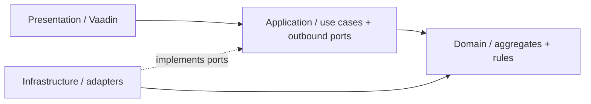
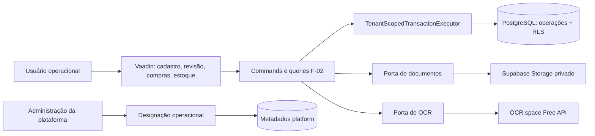
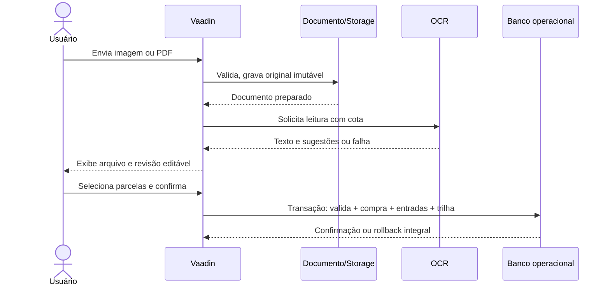

# F-02 — Desenho técnico de cadastro, compras e estoque

**Status:** Proposta revisada; implementação não iniciada.
**Data:** 22 de setembro de 2026
**Base:** [spec.md](spec.md), [context.md](context.md), PRD V0 e ADR-015 a
ADR-024 e as decisões de DDD tático pragmático e autorização entre contextos desta revisão. **Responsável técnico:** a definir na execução.

## Contexto e problema

A F-00 já fornece autenticação, resolução de um tenant por usuário e execução
transacional com RLS. A F-01 administra memberships, mas ainda não designa
responsáveis operacionais. A F-02 deve criar essa designação e o primeiro fluxo
operacional completo: insumo, documento, compra, entrada e saldo.

Uma nota pode conter compras pessoais, itens ilegíveis e unidades diferentes
da unidade de estoque. Uma confirmação incorreta não pode ser corrigida
apagando a entrada: a compra, o lote, a movimentação e o histórico precisam
permanecer reconciliáveis. OCR e Storage são externos ao PostgreSQL e exigem
estados de preparação separados da transação que confirma a compra.

## Escopo

Inclui insumos, estabelecimentos, designação do responsável, arquivo original,
OCR e revisão, compra, histórico de preços, entradas, saldo inicial, descarte,
ajustes, correção, adição de item e cancelamento. A F-02 oferece o saldo por
origem que F-06, F-07 e F-08 usarão.

Não inclui planejamento de quanto comprar, produção, cálculo exibido de CMV,
XML fiscal, consulta externa da NF-e ou perda natural automática.

## Decisão arquitetural

Manter **catálogo**, **importação**, **compras** e **estoque** como módulos do
contexto Tenant Operations dentro do monólito. Casos de uso de escrita
coordenam os módulos em uma transação PostgreSQL local; leitura usa queries
separadas. O documento e o OCR são preparados antes da confirmação, sem
movimento de estoque. O livro de movimentações por origem é a fonte do saldo.

### Organização por camadas e agregados

Seguir a organização do serviço `ordering` do Algashop: cada bounded context
mantém as quatro camadas no seu pacote raiz; conceitos e agregados são
organizados abaixo de cada camada. Em Tenant Operations, catálogo, importação,
compras e estoque são capacidades internas do mesmo bounded context, não novos
bounded contexts:

```text
platform/administration/
  domain/model/{tenant, membership, operational-assignment}/
  application/{tenant, membership, operational-assignment}/
  infrastructure/{persistence, integrations}/
  presentation/{tenant, membership}/

operations/
  domain/model/{catalog, importing, purchasing, stock}/
  application/{catalog, importing, purchasing, stock}/
  infrastructure/
    persistence/{catalog, importing, purchasing, stock}/
    integration/{storage, ocr, platform-authorization}/
  presentation/{catalog, importing, purchasing, stock}/
```

Cada camada tem uma responsabilidade e uma direção de dependência:

| Camada | Responsabilidade | Regra de dependência |
| --- | --- | --- |
| `presentation` | Views e componentes Vaadin do bounded context, agrupados pela capacidade que atendem. | Chama somente casos de uso/queries de `application`; não acessa JPA nem repositórios. |
| `application` | Commands, queries, autorização, coordenação, transações e portas de saída necessárias aos casos de uso. | Depende de `domain` e contratos; não depende de implementações de `infrastructure`. |
| `domain` | Agregados, entidades, Value Objects e regras/invariantes, organizados por conceito/agregado. | Não depende de `application`, `presentation` ou adapters. Nesta F-02, entidades podem ter anotações JPA de mapeamento, mas não acessar `EntityManager` ou Spring Data. |
| `infrastructure` | Adapters de persistência, Storage, OCR e integração entre bounded contexts. | Implementa portas internas; não é chamada diretamente por `presentation` nem contém regras de negócio. |

A organização do Algashop é referência para as quatro camadas e o agrupamento
por conceito, não uma exigência de copiar suas escolhas de persistência: neste
desenho F-02 mantém a decisão pragmática de mapear entidades de domínio com
JPA, sem duplicá-las como entidades de persistência. `tenancy` continua como
capacidade técnica compartilhada para identidade/contexto e transação RLS; não
vira dono de regras de catálogo, compra ou estoque. Um bounded context é o
único escritor de suas tabelas; integrações entre contextos usam contratos
publicados, sem importar entidades ou repositórios internos.

A `OperationalAuthorizationPort` fica em `operations/application`; seu adapter
fica em `operations/infrastructure/integration/platform-authorization` e
consulta o contrato somente-leitura publicado por
`platform/administration/application`. A UI e os casos de uso operacionais não
leem diretamente as tabelas de designação da plataforma.




### Fluxo de documento e confirmação



O upload, a leitura e a revisão não criam compra confirmada nem saldo. Uma
falha do OCR mantém o documento preparado e permite preencher os campos
manualmente. O comando de confirmação exige documento disponível e dados
revisados, sem chamar Storage ou OCR durante a transação de estoque.

## Fronteiras e componentes

| Componente | Responsabilidade | Reuso / fronteira |
| --- | --- | --- |
| Designação operacional em `platform` | Conceder/revogar a permissão a membership ativa do tenant e auditar a ação. | `PlatformMembershipAdminService`, auditoria administrativa; sem consulta operacional. |
| Catálogo em `operations/catalog` | Insumo, nome normalizado, unidade-base e estabelecimento. | `TenantScopedTransactionExecutor`; regras no domínio. |
| Importação em `operations/importing` | Arquivo, hash, estado de preparo, OCR, sugestões e revisão. | Portas para Storage e provedor de OCR; nenhum acesso direto do domínio a HTTP. |
| Compras em `operations/purchasing` | Compra, item, seleção parcial, preço, desconto, duplicidade, revisão e cancelamento. | Commands/queries separados conforme ADR-024. |
| Estoque em `operations/stock` | Entrada identificável, movimento, saldo físico e aproveitável, trava de origem. | Porta única reutilizada por F-07 para toda saída futura. |
| UI em `ui/operations` | Guiar upload, revisão, confirmação e consulta; apresentar erro sem persistir estado parcial. | Padrão Vaadin já usado nas telas de plataforma. |

As portas de aplicação necessárias são: `DocumentStore` (gravar/ler/retirar
arquivo por chave opaca), `TextRecognition` (texto por imagem), repositórios
de agregado e projeções de consulta. Não criar interface para cada classe do
domínio. O adaptador de Storage usa API HTTP no backend; o de OCR usa a API
HTTP do provedor OCR. Nenhum segredo chega ao navegador.

### Modelo tático pragmático

A F-02 usa DDD tático sem exigir persistência agnóstica ou duplicar cada
entidade em um modelo de domínio e outro modelo JPA. As entidades/raízes de
agregado podem ser classes de domínio mapeadas diretamente com Jakarta
Persistence/Hibernate. Isso é uma escolha deliberada para reduzir mapeamento
repetido; os casos de uso continuam dependentes de portas de repositório, e
somente os adapters implementam essas portas usando Spring Data JPA. O domínio
não injeta `EntityManager`, `JpaRepository`, JDBC ou serviços de infraestrutura.

Use acesso JPA por campos, entidades não finais e campos persistentes não finais e privados, construtor sem
argumentos `protected` exigido pelo provedor e construtores/fábricas de domínio
que validem o estado inicial. Não exponha setters públicos para estado de
negócio. Mudanças devem ser operações com intenção do domínio e suas guardas,
como `renomear`, `confirmar`, `corrigirQuantidade`, `cancelar` e
`registrarMovimento`. As anotações ORM não substituem validações, constraints,
RLS ou autorização. Value Objects imutáveis representam conceitos sem
identidade própria — por exemplo quantidade/unidade e valor monetário — quando
reduzirem ambiguidade e concentrarem validação; não criar um tipo para cada
primitivo por regra estética.

As raízes e limites iniciais são:

| Módulo | Raiz / modelo | Limite e referências |
| --- | --- | --- |
| `catalog` | `Ingredient`; `Establishment` como entidade simples | Nome normalizado, grandeza e unidade-base são protegidos pelo insumo. Estabelecimento pode ter somente operações justificadas por regras reais. Unicidade por tenant continua garantida no banco e verificada pelo caso de uso. |
| `importing` | `ImportDocument` como raiz do preparo e revisão; candidatos de OCR como Value Objects | O documento controla transições do próprio estado. Storage, OCR e cota são coordenados fora da entidade; o objeto original permanece imutável. |
| `purchasing` | `Purchase` como raiz; `PurchaseItem` como entidade filha; revisões como registros imutáveis | A compra protege seleção, confirmação e mudanças coerentes de seus itens. Documento, estabelecimento e insumo são referenciados por ID, não por grafos JPA entre agregados. |
| `stock` | `StockEntry` como raiz da origem; `StockMovement` como registro imutável identificado pela entrada | O saldo é derivado dos movimentos. O adapter carrega/trava uma origem e calcula seu saldo dentro da transação; a raiz valida a movimentação solicitada. Não carregar uma coleção histórica ilimitada de movimentos na entidade. |
| `platform` | `OperationalManagerAssignment` como raiz da designação | Conceder/revogar e validar o estado pertencem ao modelo; a associação com membership é por ID. A restrição de uma designação ativa também é garantida no banco. |
### Contrato de autorização entre contextos

`Platform Administration` é a fonte da designação de responsável; `Tenant
Operations` é responsável por aplicar a autorização antes das ações protegidas.
A fronteira será explícita e unidirecional:

1. `Tenant Operations` define a porta de saída
   `OperationalAuthorizationPort`, recebendo a identidade e o tenant do
   `TenantAccessContext` resolvido pelo backend, mais uma ação restrita.
2. A porta oferece `requireAuthorized(context, action)`: retorna normalmente
   quando autorizado e falha com negação de domínio/aplicação quando não
   autorizado. A enumeração de ações é fechada ao escopo atual:
   `CORRECT_PURCHASE`, `ADD_PURCHASE_ITEM`, `CANCEL_PURCHASE_ITEM`,
   `CANCEL_PURCHASE` e `MANUAL_STOCK_ADJUSTMENT`.
3. O adapter de `Tenant Operations` consulta um contrato de aplicação
   somente-leitura publicado por `Platform Administration`. Esse contrato
   valida que existe membership ativa da identidade no tenant indicado e que
   há designação ativa ligada àquela membership. Membership revogada, outra
   identidade/tenant, designação revogada ou ausência de designação resultam
   em negação.
4. O adapter não acessa diretamente entidade ou repositório JPA de
   `Platform Administration`; não recebe tenant/ator da UI; não concede
   acesso a dados operacionais nem confia no papel `PLATFORM_ADMIN` como
   autorização operacional.
5. O caso de uso chama a porta dentro da transação já aberta pelo executor de
   tenant e antes da primeira mutação. A implementação usa a mesma transação
   local; a negação não pode deixar alteração parcial. A UI pode consultar a
   autorização para exibir ações, mas o command sempre valida novamente no
   servidor.

A consulta de autorização é o contrato interno entre os contextos: a
administração conhece apenas identity/tenant/designação; a operação conhece
apenas a decisão para uma ação. Testar permitido para responsável ativo,
negado para usuário sem designação, membership revogada, tenant diferente e
administrador de plataforma sem membership/designação operacional.

Uma tabela não define automaticamente um agregado: por exemplo, a revisão e o
movimento são registros persistidos, não motivo para carregar todo o histórico
como uma coleção mutável. Consultas de listagem e busca podem usar projeções,
sem hidratar agregados quando nenhum comportamento será executado.

Casos de uso coordenam autorização, contexto de tenant, portas, locking e
persistência. Uma transação pode atravessar mais de um agregado quando a regra
da V0 exige atomicidade local — especialmente confirmar/corrigir/cancelar uma
compra junto com suas entradas e movimentos. Essa coordenação síncrona é uma
exceção deliberada ao conselho genérico de uma transação por agregado: cada
agregado protege suas invariantes, e o caso de uso ordena o fluxo e garante
commit ou rollback total. Não introduzir eventos de domínio, mensageria ou
consistência eventual sem consumidor/requisito concreto; a F-02 não usa
event sourcing.

## Modelo de domínio e persistência

| Tabela persistida | Campos e regra principal |
| --- | --- |
| `platform.operational_manager_assignment` | `id`, `tenant_id`, `membership_id`, estado, autor, datas. Uma designação ativa por membership; uma ou mais por tenant. Revogação preserva histórico. |
| `operations.ingredient` | `id`, `tenant_id`, nome exibido, chave normalizada, grandeza e unidade-base. Unicidade de nome idêntico por tenant; similaridade apenas avisa. |
| `operations.establishment` | `id`, `tenant_id`, nome e metadados mínimos. Referenciado pela compra. |
| `operations.import_document` | `id`, `tenant_id`, finalidade lista/comprovante, chave opaca no bucket, hash SHA-256, MIME, tamanho, estado, autor e datas. Original imutável. |
| `operations.purchase` | `id`, `tenant_id`, documento, data, estabelecimento, chave fiscal opcional, estado e autor. Chave e hash de documento usado por compra confirmada permanecem reservados após cancelamento. |
| `operations.purchase_item` | `id`, compra, linha original, insumo, quantidade/unidade documentada, parcela selecionada, quantidade-base, valor líquido da parcela, estado. |
| `operations.purchase_revision` | `id`, compra/item, ação, antes/depois, motivo, autor e instante. Não substitui movimentos de estoque. |
| `operations.stock_entry` | `id`, `tenant_id`, insumo, tipo compra/saldo inicial/ajuste, item de origem opcional, datas aplicáveis, custo total conhecido ou `NULL`. |
| `operations.stock_movement` | `id`, `tenant_id`, entrada, tipo, direção, quantidade-base positiva, motivo quando exigido, autor e instante. Sem `UPDATE`/`DELETE` operacional. |
| `operations.ocr_usage` | `id`, `tenant_id`, mês, dia UTC, documento/página/tentativa, reserva de uma requisição, estado e instante. T12 remove a unicidade apenas por documento/página e registra cada chamada externa; timeout ambíguo fica `UNCERTAIN` e continua consumindo cota. |
| `platform.ocr_monthly_quota` | Mês e requisições Engine 3 globalmente reservadas, com limite inicial 2.500; acesso interno restrito ao backend. |
| `platform.ocr_daily_quota` | Dia UTC e requisições globalmente reservadas, com limite inicial 500 para o IP de saída compartilhado; acesso interno restrito ao backend. |

Todas as tabelas `operations` têm `tenant_id`, índices de consulta por
tenant e RLS `ENABLE` + `FORCE`, com políticas e grants explícitos para
`app_runtime`. O tenant vem do executor; IDs recebidos da UI são validados
sob esse contexto. O esquema é aditivo e usa somente migrations Flyway com
reversão controlada, conforme ADR-019 a ADR-022.

A data operacional para validade usa a zona do tenant em
`operations.tenant_settings`, inicialmente `America/Sao_Paulo` para o piloto;
ela não depende do fuso do servidor. O contador global de OCR é atualizado
com trava transacional e não dá à administração da plataforma acesso a
documentos ou leituras de tenant.

### Invariantes de quantidade e custo

- `g`, `ml` e `un` são unidades-base. `kg` vira `g`; `l` vira `ml`.
  Quantidade-base usa decimal exato; `un` exige valor inteiro. Não há
  conversão entre grandezas sem regra explícita.
- Preço de linha e parcela selecionada usam moeda com centavos. A parcela de
  desconto no item é proporcional à quantidade selecionada, com
  arredondamento determinístico em centavos; o total de linha é preservado.
  Desconto apenas do total do comprovante não altera itens.
- O custo unitário é derivado do valor líquido selecionado dividido pela
  quantidade-base, sem gravar uma versão prematuramente arredondada. Entrada
  inicial ou ajuste positivo sem compra têm custo `NULL`, nunca zero.
- Saldo físico de uma entrada é a soma algébrica de seus movimentos. Saldo
  aproveitável soma somente entradas sem validade ou com validade maior ou
  igual à data local consultada. A validade não cria movimento.
- Toda baixa trava a linha da `stock_entry`, lê o saldo da origem e grava
  movimento na mesma transação. Compra inteira trava entradas por ID em ordem
  estável. A mesma porta será obrigatória para o consumo da F-07.
- Correção de quantidade grava delta de movimento na mesma origem e não pode
  ficar abaixo da soma de todas as saídas já feitas nela. Cancelamento exige
  o total original disponível nessa origem; registra reversão, não exclusão.
- Correção de preço preserva revisão e altera a base de custo do item/entrada.
  F-08 recalculará valores realizados associados às quantidades consumidas
  dessa entrada; a F-02 não materializa CMV antes da F-08.

## Integração de arquivo e OCR

### Supabase Storage

Bucket **privado** para originais. A UI envia ao backend; o backend valida
identidade, tenant, tipo real do arquivo e tamanho, gera chave opaca por
tenant/documento e faz upload sem sobrescrever. O segredo de Storage fica
somente no backend. A leitura também passa pelo backend e pela autorização
do tenant; nenhuma URL pública permanente é exposta. A chave de serviço do
Storage ignora RLS do próprio Storage, portanto o adaptador deve ser pequeno,
testado e nunca aceitar caminho arbitrário enviado pelo cliente. O RLS do
PostgreSQL protege os metadados operacionais.

O documento tem estados `PREPARING`, `READY`, `CONFIRMED` e
`ABANDONED`. Um registro de preparo é criado antes do upload; falha deixa
o registro sem possibilidade de confirmação. Um arquivo órfão ou preparo
abandonado é identificado por chave e estado para limpeza controlada. Arquivos
de compras confirmadas não são removidos por essa limpeza.

### OCR escolhido

O usuário escolheu OCR.space Free API na decisão de 2 de outubro de 2026. A
aplicação define uma porta de saída de OCR; a infraestrutura implementa um
adapter HTTP para OCR.space. A chave `OCR_SPACE_API_KEY` fica em variável de
ambiente privada no backend, nunca no Git nem no navegador. O caso de uso e o
domínio não dependem do SDK, endpoint ou formato proprietário do provedor.

O PDF primeiro tenta extração de texto digital; páginas que dependem de OCR
são renderizadas localmente com Apache PDFBox 3.0.8 e enviadas como imagens,
uma requisição por página. Isso evita upload do original ao provedor e evita
usar a API de PDF multipágina do OCR.space: o limite de três páginas por PDF
não se aplica às imagens individuais. O limite publicado é **1 MB por arquivo
da API**; o adapter aplica um teto conservador de 1.000.000 bytes a cada imagem
enviada. Imagem acima do limite não é enviada; o original permanece anexado e
a pessoa recebe caminho de revisão manual.
PDFBox mantém os limites locais de 6 MiB por original, cinco páginas, 150 DPI,
8 megapixels por página e 12 MiB somados de PNGs.

A T12 usará OCR.space **Engine 3**, pois o provedor o indica para escrita à
mão, tabelas e mais de 200 idiomas. A língua é Português (`por`), saída em
texto sem overlay e `isTable=true` para preservar linhas de recibos/notas. O
parser determinístico propõe campos/linhas, mostra incerteza e exige revisão
humana. OCR nunca confirma compra nem cria movimento de estoque. O original
fica no Supabase; apenas as imagens das páginas necessárias são enviadas ao
OCR.space.

O plano Free publica **500 requisições por dia por IP**, **25.000 conversões
mensais para Engines 1/2** e outras **2.500 conversões mensais para Engine 3**.
Como o aplicativo usará Engine 3, a cota mensal interna inicial é 2.500; cada
página que precisa de OCR equivale a uma conversão/requisição. Uma migration
T12 adapta o contador mensal existente (atualmente preparado para 900) e cria
contador global diário, com reserva transacional antes da chamada. Contadores
são globais entre tenants e instâncias. Chamadas de outros sistemas no mesmo
IP/quota do provedor podem reduzir a disponibilidade real; o limite do
provedor permanece autoridade final. Sem cota, key ou disponibilidade, o
arquivo continua anexado e segue para revisão/transcrição manual.

Cada chamada externa tem seu próprio registro e reserva. T12 não faz retry
automático. Uma falha/timeout ambíguo fica `UNCERTAIN` e não devolve a unidade,
pois o provedor pode ter contado a requisição; uma nova tentativa explícita
reserva outra unidade. A repetição de uma chamada já concluída e persistida é
resolvida pelo fluxo de revisão da T13, que reutiliza o resultado sem nova
requisição. Limites e qualidade serão aferidos com imagens reais na aceitação
da T25; o plano gratuito não tem SLA e o provedor pode alterar as condições.

Na T11, o processamento local limita a extração a 100.000 caracteres por
página, renderiza somente páginas sem texto digital a 150 DPI em tons de cinza,
recusa uma página acima de 8 megapixels e limita o PNG total a 12 MiB. O
`PDDocument` é fechado por escopo e o cache de streams usa arquivos temporários;
o OCR permanece fora deste processamento.

### Contratos de entrada da UI

O produto usa Vaadin Flow: não há necessidade de criar API pública nova para
upload. O componente Upload entrega o fluxo a um handler no servidor, com um
arquivo por revisão. Os comandos de aplicação recebem apenas referências
opacas a documento pronto, dados revisados e IDs de insumo/estabelecimento.
Consultas devolvem candidatos de OCR, histórico, saldos e documento somente
ao tenant autorizado. A UI nunca envia `tenant_id` como autoridade.

## Tratamento de erros e segurança

| Situação | Resultado |
| --- | --- |
| Arquivo/tipo/página/tamanho inválido | Rejeita preparo com mensagem específica; sem compra ou movimento. |
| Storage indisponível | Documento não fica `READY`; retry seguro, sem estoque. |
| OCR.space indisponível, chave ausente, imagem acima de 1 MB ou cota esgotada | Mantém arquivo e abre revisão/transcrição manual; sem confirmação automática. |
| Chave fiscal ou hash já usado | Avisa e bloqueia segunda confirmação no tenant; índice único fecha corrida. |
| Documento semelhante | Avisa e exige decisão humana; sem bloqueio automático. |
| Permissão insuficiente | Nega alteração confirmada ou ajuste, com trilha de tentativa quando aplicável. |
| Saldo insuficiente em uma origem | Bloqueia saída/cancelamento e reverte o comando inteiro. |
| Erro ao persistir compra/movimento | Rollback local; documento preparado pode ser reaberto para tentativa. |

O documento pode conter dados pessoais da compra doméstica. O backend envia
apenas a página necessária ao OCR externo; não registra imagem, texto bruto,
segredo nem preços pessoais em logs técnicos. Acesso ao original exige
autorização do tenant. Antes de operar dados reais, verificar termos e
tratamento de dados do provedor e credenciais do projeto.

## Reuso, riscos e preocupações observadas

| Achado | Evidência | Impacto | Mitigação |
| --- | --- | --- | --- |
| Só há `TENANT_USER` na F-01. | `platform/identity/model/MembershipRole.java` | Correção/ajuste não têm permissão específica. | Designação em metadados de membership, sem promover plataforma a operador. |
| Executor permite contexto já resolvido. | `tenancy/application/TenantScopedTransactionExecutor.java` | Uso incorreto pode contornar a resolução da identidade. | UI e comandos F-02 entram pelo overload com `ExternalSubject`; testes de acesso cruzado. |
| Storage não participa da transação ACID. | ADR-018 e docs do Supabase | Pode haver preparo/objeto órfão. | Estado de preparo, chave opaca, retry e reconciliação; confirmação somente no banco. |
| PDF convertido em imagem consome memória/CPU e pode exceder o limite de upload do OCR.space. | PDFBox e limite de 1 MB por arquivo da API | Documento grande pode afetar o runtime gratuito ou não caber na API. | Limites de 6 MB/5 páginas e processamento por página; imagem acima de 1 MB segue para revisão manual, sem upload ao OCR. |
| Testes de integração usam PostgreSQL real. | `src/test/.../integration` e `AGENTS.md` | Banco compartilhado antigo pode contaminar gates. | Banco isolado novo por gate completo. |
| Chave privilegiada de Storage contorna RLS. | Documentação oficial Supabase | Falha no adaptador pode expor arquivo de outro tenant. | Backend exclusivo, busca por ID sob RLS, nenhuma chave de objeto arbitrária. |

## Alternativas consideradas

| Opção | Avaliação |
| --- | --- |
| **OCR.space Free API, Engine 3** | Escolhida pelo usuário para o primeiro estágio: cota publicada de 2.500 conversões Engine 3/mês e 500 requisições/dia por IP; Engine 3 declara suporte forte a escrita à mão e tabelas. Exige chave, depende de serviço externo sem SLA grátis e envia imagens de página a terceiro. |
| Tesseract local | Sem cobrança por página nem envio ao OCR SaaS, mas qualidade de manuscrito e custo de CPU/memória no Render precisam ser aferidos; mantido como alternativa futura. |
| OCR.space recebendo PDF multipágina | Não escolhido: o fluxo envia imagens página a página, compatível com cota por requisição e sem depender do limite de três páginas por PDF do plano grátis. |
| Saldo mutável em coluna | Consulta barata, mas facilita divergência com histórico. O livro de movimentos continua fonte; otimização só após medição. |

## Plano de implementação, validação e reversão

1. Evoluir permissões e schema com migrations Flyway revisadas e testes de
   grants/RLS em PostgreSQL isolado.
2. Entregar catálogo, unidades e livro de movimentos antes de compras.
3. Entregar armazenamento e OCR com fakes/contratos, cota e revisão humana.
4. Confirmar compras e implementar correção, cancelamento e inclusão.
5. Expor telas Vaadin e validar fluxos completos, concorrência e isolamento.

Cada command tem testes de domínio e integração com falha/rollback; adapters
externos usam testes de contrato sem depender de chamada real no gate local.
Telas têm testes de estados autorizado, vazio, erro e revisão. A aceitação
final exige arquivo real de teste digitado e manuscrito, mais uma nota/recibo
representativo; qualidade do OCR é avaliada por sugestões úteis e correção
humana, não por confirmação automática.

As migrations são aditivas. Em falha de deploy, impedir operação F-02,
preservar arquivos/compras já confirmados e executar correção forward ou
reversão controlada após avaliar dados e backup. Não usar `flyway undo`
na edição Community nem apagar histórico operacional.

## Fontes oficiais consultadas

- [Jakarta Persistence 3.2, entidades e acesso por campos](https://jakarta.ee/specifications/persistence/3.2/jakarta-persistence-spec-3.2) e [Spring Data JPA 4.1.1, definição de repositórios](https://docs.spring.io/spring-data/jpa/reference/repositories/definition.html).
- [Spring Boot 4.1.1 e dependências gerenciadas](https://docs.spring.io/spring-boot/appendix/dependency-versions/)
  e [Spring Data JPA 4.1.1, locking](https://docs.spring.io/spring-data/jpa/reference/jpa/locking.html).
- [PostgreSQL 17, RLS](https://www.postgresql.org/docs/17/ddl-rowsecurity.html)
  e [locks de linha](https://www.postgresql.org/docs/17/explicit-locking.html).
- [Vaadin Upload Flow](https://vaadin.com/docs/latest/components/upload/file-handling).
- [Supabase Storage privado](https://supabase.com/docs/guides/storage/buckets/fundamentals),
  [controle de acesso](https://supabase.com/docs/guides/storage/security/access-control)
  e [upload padrão](https://supabase.com/docs/guides/storage/uploads/standard-uploads).
- [OCR.space Free API: limites, parâmetros de imagem, idiomas, Engine 3 e cotas](https://ocr.space/ocrapi),
  [cadastro da chave grátis](https://ocr.space/ocrapi/freekey) e
  [FAQ de privacidade e disponibilidade](https://ocr.space/faq).
- [PDFBox 3.0.8](https://pdfbox.apache.org/3.0/getting-started.html) e
  [Flyway Community/Undo](https://documentation.red-gate.com/flyway/learn-more-about-flyway/feature-summary).
