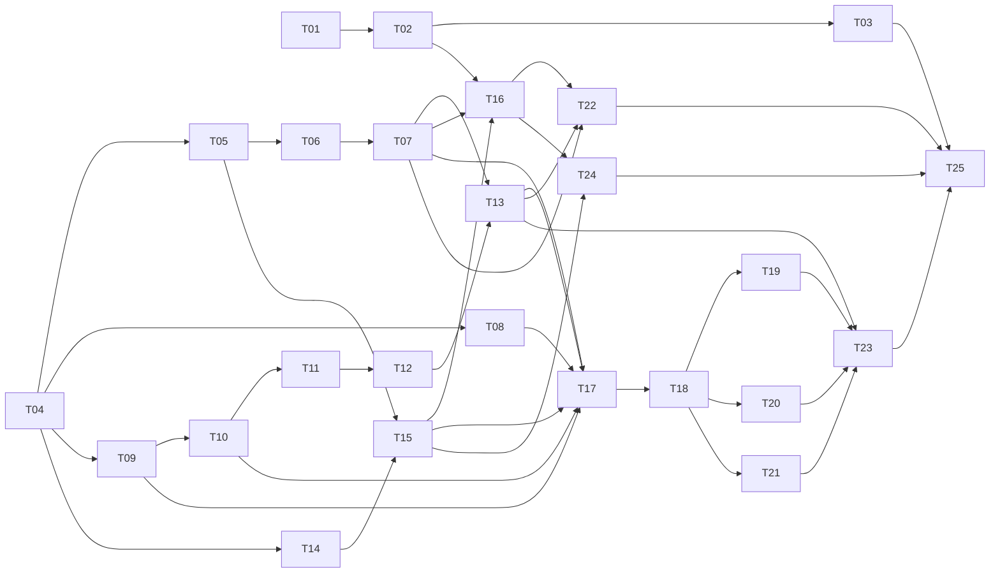

# F-02 — Tarefas de implementação

**Status:** Em execução; T01–T07 concluídas.
**Design:** [design.md](design.md)
**Spec:** [spec.md](spec.md)
**Escopo:** somente V0. Cada Txx é um incremento coeso com testes no mesmo
commit; não iniciar F-03/F-06/F-07/F-08 aqui.

**Decisão de sequência (2 de outubro de 2026):** a T23 da F-01 permanece
aberta para revisão independente e UAT final, mas não bloqueia a F-02. O
núcleo de autenticação, membership, autorização e isolamento de tenant da F-01
está implementado, passou pelo gate automatizado e está publicado no Render.
A T23 pode ser concluída em paralelo. Se a revisão identificar uma falha nesse
núcleo, interrompa apenas as tarefas da F-02 afetadas até a correção e
revalidação.

## Protocolo de execução

- Ativar `tlc-spec-driven` na execução, ler seu fluxo Execute e fazer **um
  commit atômico por tarefa**, incluindo seus testes e evidência.
- Antes da T01, conferir o diff e preservar mudanças já presentes em
  `docs/PRD-V0.md`, `docs/ROADMAP-V0.md` e
  `src/main/resources/application.yaml`; não incluí-las automaticamente
  em commits de implementação.
- Revisar documentação oficial da versão efetiva antes de alterar dependência,
  migration ou configuração. PDFBox 3.0.8 é proposta, não dependência atual.
  Toda adição exige atualizar `AGENTS.md`, árvore efetiva e compatibilidade.
- Para mudanças de banco, criar migration Flyway versionada, script de
  reversão controlada, grants, índices e RLS. Nunca usar Supabase CLI como
  segundo histórico nem depender de `flyway undo`.
- Comandos operacionais entram por identidade autenticada e
  `TenantScopedTransactionExecutor`. O RLS com `app_runtime` é testado em
  PostgreSQL real. Chave do Storage e chave do Vision só no backend.
- O gate completo usa **banco PostgreSQL isolado e novo**, não o banco local
  compartilhado que precede V2. O histórico de testes da F-01 fechou em 155;
  registrar a contagem real no início da execução e garantir que não caia.
- Ao fim, executar revisão independente, teste de discriminação e registrar
  evidência em `validation.md`, conforme a skill. Nenhuma tarefa está
  autorizada a apagar testes existentes para passar no gate.

## Organização por camadas e agregados

Seguir em F-02 a convenção observada no serviço `ordering` do Algashop:
`domain`, `application`, `infrastructure` e `presentation` são as quatro
camadas no pacote raiz de cada bounded context. Dentro de cada camada, os
pacotes são agrupados por conceito/capacidade/agregado, conforme o desenho;
catálogo, importação, compras e estoque continuam dentro de Tenant Operations.

- Presentation chama Application; Application usa Domain e portas;
  Infrastructure implementa portas. Views não acessam JPA diretamente.
- Um bounded context não importa entidades ou repositórios internos de outro.
  Integrações passam pelo contrato de aplicação publicado, incluindo a query de
  Platform Administration usada pelo adapter da `OperationalAuthorizationPort`.
- A persistência JPA do domínio é a escolha pragmática específica da F-02; o
  restante do padrão de camadas não exige classes duplicadas para mapeamento.
- Cada tarefa mantém seus arquivos nas camadas/capacidades envolvidas e inclui
  testes das fronteiras que alterar. A F-02 não exige mover ou refatorar o
  código já entregue pela F-01.
## Regras de modelagem tática para todas as tarefas

- Entidades/raízes de agregado F-02 podem usar Jakarta Persistence/Hibernate
  diretamente no modelo de domínio, com acesso por campos. Isso evita duplicar
  cada objeto em um mapeamento JPA separado; ports/repositórios continuam sendo
  fronteiras de aplicação, implementadas pelos adapters Spring Data JPA.
- Estado de negócio não recebe setters públicos. Entidades JPA não são `final`, têm construtor `protected` sem argumentos e campos/métodos persistentes não finais, conforme Jakarta Persistence 3.2. Construtores/fábricas de domínio validam
  criação; métodos com intenção do domínio validam e executam transições.
  Getters necessários para consulta/persistência são permitidos, mas não podem
  servir como API de alteração livre.
- Value Objects são usados onde encapsulam invariantes ou removem ambiguidade,
  principalmente quantidade/unidade, valor monetário e candidato de importação.
  Não criar tipos ou serviços sem regra que justifique a abstração.
- A autorização de ações restritas usa `OperationalAuthorizationPort`, descrita
  no desenho; é chamada dentro da transação e antes da mutação. A UI não é
  autoridade.
- O caso de uso coordena identidade, autorização, tenant, locks, repositórios e
  transação; não replica regras que pertencem a uma entidade/raiz. Regras que
  dependem de consulta entre agregados podem ficar no caso de uso/domain policy
  e devem declarar essa necessidade.
- Operações em múltiplos agregados podem compartilhar uma transação local para
  cumprir atomicidade da V0. Não mover compra/estoque para consistência eventual
  nem adicionar eventos/mensageria/event sourcing sem requisito concreto.
- Testes unitários chamam comportamento de domínio diretamente e provam
  invariantes/estados inválidos; testes de integração provam persistência,
  constraints, locking, tenant/RLS e rollback. Não basta testar somente o
  coordenador ou a tela.
## Matriz de cobertura de testes

> Gerada de `AGENTS.md`, `pom.xml`,
> `src/test/java/.../platform/identity/model/PlatformRoleAssignmentTests.java`,
> `src/test/java/.../integration/tenancy/RlsTenantContextIntegrationTests.java`,
> `src/test/java/.../integration/platform/administration/PlatformProvisioningEndToEndIntegrationTests.java`
> e `src/test/java/.../ui/platform/PlatformAdministrationViewIntegrationTests.java`.
> O projeto usa JUnit/Spring Boot e PostgreSQL real nos fluxos integrados.

| Camada | Tipo obrigatório | Cobertura esperada | Local | Comando de gate |
| --- | --- | --- | --- | --- |
| Regras de domínio e cálculo | Unitário | Cada AC correspondente, variantes, limites e erros; custos/quantidades exatos. | `src/test/java/.../operations/**` | `.\mvnw.cmd verify` |
| Casos de uso e autorização | Unitário + integração | Sucesso, negação, rollback, idempotência e concorrência dos comandos. | `src/test/java/.../operations/**`, `integration/**` | `.\mvnw.cmd verify` |
| Persistência, RLS e migrations | Integração PostgreSQL | Dois tenants, `app_runtime`, contexto ausente, constraints, índices essenciais e reversão revisada. | `src/test/java/.../integration/database/**` | `.\mvnw.cmd verify` |
| Storage, PDF e OCR | Contrato + integração local | Upload/download privados, falhas, limites, cota, retry e parser; fakes substituem serviços externos no gate. | `src/test/java/.../operations/importing/**` | `.\mvnw.cmd verify` |
| Vaadin | Integração de UI | Acesso permitido/negado, estados vazios, revisão, erros e confirmações. | `src/test/java/.../ui/operations/**` | `.\mvnw.cmd verify` |

**Regra de cobertura:** cada tarefa que altera código inclui testes na mesma
tarefa. A T25 adiciona cenários de ponta a ponta que cruzam módulos, sem
substituir os testes específicos anteriores. Testes de OCR real com documentos
representativos e credencial externa compõem validação manual de aceitação,
fora do gate local determinístico.

## Avaliação de paralelismo

| Tipo | Seguro em paralelo? | Evidência e decisão |
| --- | --- | --- |
| Unitários puros | Sim | Objetos/fakes locais, como testes de modelo da F-01. |
| Contratos de adapter com fakes | Sim | Sem serviço externo ou banco compartilhado. |
| Integração PostgreSQL e UI Spring | Não presumir | Migrações, fixtures e limpeza usam o mesmo banco do gate; executar gates sequencialmente em banco isolado. |
| Tarefas desta lista | Não marcadas `[P]` | Mesmo onde o código é independente, commits e gates serão serializados para preservar evidência e histórico atômico. |

## Comandos de verificação

| Gate | Quando | Comando |
| --- | --- | --- |
| Infra local | Antes de gates completos | `docker compose --env-file .env.local.example up -d` |
| Completo | Ao concluir cada Txx de código | `.\mvnw.cmd verify` com variáveis apontando para banco PostgreSQL isolado novo |
| Documental | Após mudanças em spec/design/tasks | `git diff --check` e inspeção dos arquivos novos |

O comando `verify` é o gate observado no projeto; a criação do banco
isolado e suas variáveis são preparadas no início da execução conforme
`AGENTS.md`, sem reutilizar a base contaminada. Não presumir paralelismo
do Maven ou contagem fixa de testes após o primeiro novo caso.

## Plano e dependências

Fases: **1** permissões e cadastro (T01–T08); **2** documentos/OCR
(T09–T13); **3** estoque (T14–T16); **4** compras (T17–T21);
**5** telas e validação (T22–T25). A numeração é a ordem recomendada; o
grafo registra dependências reais. Não iniciar uma tarefa antes de seus pais
terem gate e commit concluídos.

## Tarefas

### Fase 1 — Permissões e cadastro

| Tarefa | Entrega atômica | Depende | Requisitos | Testes / mínimo novo |
| --- | --- | --- | --- | --- |
| **T01** | Migration + reversão da designação operacional em `platform`, auditoria e restrições de membership ativa. | — | F02-24, F02-30 | Integração PostgreSQL / 3 cenários |
| **T02** | `domain`: raiz `OperationalManagerAssignment`; `application`: commands de designar/revogar e contrato de query somente-leitura para identidade + tenant com membership/designação ativas; `infrastructure`: persistência/adapters. Sem ler operações. | T01 | F02-24, F02-30, F02-32 | Domínio + aplicação + integração / 5 cenários |
| **T03** | Controle da designação na tela de administração existente, com estado ativo/revogado e mensagem de acesso negado. | T02 | F02-24 | UI integração / 3 cenários |
| **T04** | Migration + reversão de insumo, estabelecimento e zona operacional do tenant, com RLS, grants, índices e unicidade. | — | F02-01 a F02-03, F02-20, F02-30 | Integração PostgreSQL / 4 cenários |
| **T05** | Raiz `Ingredient` mapeada por JPA, com comportamento de domínio para nome/unidade e Value Objects de unidade/quantidade onde agreguem validação; conversão decimal de `kg/g`, `l/ml` e `un`. Sem setters públicos de negócio. | T04 | F02-01, F02-02, F02-12 | Domínio unitário / 6 cenários |
| **T06** | Adapter de persistência de insumo com busca exata e candidatos semelhantes restritos ao tenant. | T05 | F02-01, F02-02, F02-30 | Integração PostgreSQL / 4 cenários |
| **T07** | Commands/queries de insumo: chamar operações de domínio para criar/renomear; coordenar unicidade exata por tenant e candidatos semelhantes via porta; sem setters em cadeia nem saldo inicial. | T06 | F02-01, F02-02, F02-30 | Domínio + aplicação: unitário e integração / 4 cenários |
| **T08** | Entidade `Establishment` com operações apenas para regras reais de cadastro; command/query e adapter de persistência por tenant, sem criar comportamento artificial. | T04 | F02-03, F02-30 | Domínio + integração / 3 cenários |

**Concluído quando:** T01–T08 têm seus testes e gates aprovados, migrations
aplicam em banco vazio, designação não abre dados operacionais à plataforma e
insumo/estabelecimento não atravessam tenant. Cada tarefa gera um commit
`feat(f02): Txx ...` limitado a seus arquivos.

### Fase 2 — Documentos e OCR

| Tarefa | Entrega atômica | Depende | Requisitos | Testes / mínimo novo |
| --- | --- | --- | --- | --- |
| **T09** | Migration + reversão de documento preparado, compra, itens, revisões, uso de OCR e contador global; índices de chave/hash e RLS operacional. | T04 | F02-07, F02-15 a F02-17, F02-30 | Integração PostgreSQL / 5 cenários |
| **T10** | Porta e adapter de Supabase Storage privado mais fluxo de preparar/ler documento por ID autorizado; hash, tipo real, tamanho e chave opaca. | T09 | F02-07, F02-09, F02-30, F02-31 | Contrato + integração / 6 cenários |
| **T11** | Extração de texto digital e renderização limitada de PDF para páginas de OCR com PDFBox; validar Java 21, limites e memória. | T10 | F02-04, F02-07, F02-08 | Unitário + contrato / 4 cenários |
| **T12** | Adapter Vision `DOCUMENT_TEXT_DETECTION` por página e contador mensal com reserva segura/retry; sem confirmação automática. | T11 | F02-04, F02-08, F02-31 | Contrato + integração / 6 cenários |
| **T13** | Value Objects de candidatos e commands que aplicam revisão/transições válidas em `ImportDocument`; parser determinístico; falha do OCR permite preenchimento humano sem confirmar compra/estoque. | T12, T07 | F02-04 a F02-06, F02-08 a F02-10 | Domínio + aplicação: unitário e integração / 7 cenários |

**Concluído quando:** arquivo original é recuperável apenas pelo tenant;
imagem, PDF digitado e PDF escaneado produzem candidatos revisáveis; cota e
falhas nunca geram insumo/compra/estoque sozinhos. Cada tarefa inclui testes e
um commit próprio.

### Fase 3 — Estoque

| Tarefa | Entrega atômica | Depende | Requisitos | Testes / mínimo novo |
| --- | --- | --- | --- | --- |
| **T14** | Migration + reversão de entrada e movimento imutável com RLS, FK, checks e índices por origem. | T04 | F02-18 a F02-23, F02-30, F02-32 | Integração PostgreSQL / 5 cenários |
| **T15** | Raiz `StockEntry` mapeada por JPA protege validade e registro de movimento; `StockMovement` imutável. Adapter calcula saldo derivado e trava origens em ordem estável; queries retornam saldo físico/aproveitável. | T14, T05 | F02-18 a F02-20, F02-31, F02-32 | Domínio unitário + concorrência PostgreSQL / 7 cenários |
| **T16** | Commands de saldo inicial, descarte e ajuste chamam operações de `StockEntry`/`StockMovement`; ajuste manual exige `OperationalAuthorizationPort` antes de qualquer mutação. O caso de uso coordena `Ingredient` + origem em uma transação quando necessário. | T15, T02, T07 | F02-21 a F02-23, F02-24, F02-31, F02-32 | Domínio + autorização: permitir/negar sem mutação parcial; integração / 8 cenários |

**Concluído quando:** nenhuma ação deixa saldo da origem negativo, validade
altera somente aproveitável, o saldo inicial não cria compra e o responsável
é obrigatório nos ajustes. Cada tarefa inclui testes e um commit próprio.

### Fase 4 — Compras

| Tarefa | Entrega atômica | Depende | Requisitos | Testes / mínimo novo |
| --- | --- | --- | --- | --- |
| **T17** | `Purchase` como raiz e `PurchaseItem` como entidade filha: operações de seleção/confirmação validam parcelas, conversão, desconto e custo. Caso de uso coordena `Purchase`, `StockEntry` e movimento na mesma transação; ainda sem expor o command ao usuário. | T07, T08, T09, T10, T13, T15 | F02-07 a F02-14, F02-18, F02-31 | Domínio + aplicação: unitário e integração / 9 cenários |
| **T18** | Caso de uso consulta duplicidade/similaridade pela porta; constraints e locking fecham corrida. A raiz `Purchase` só confirma se documento/itens satisfazem suas regras. | T17 | F02-15 a F02-17, F02-31 | Domínio + aplicação + concorrência PostgreSQL / 6 cenários |
| **T19** | Command chama `OperationalAuthorizationPort` para `CORRECT_PURCHASE` antes de corrigir `Purchase`/`PurchaseItem`; registra revisão imutável e coordena delta por origem sob lock e transação local. | T18 | F02-24 a F02-26, F02-31, F02-32 | Domínio + autorização: permitir/negar sem mutação parcial; integração / 7 cenários |
| **T20** | Commands chamam `OperationalAuthorizationPort` (`CANCEL_PURCHASE_ITEM` ou `CANCEL_PURCHASE`) antes de alterar a compra; validam estado, travam origens em ordem estável, registram reversões e mantêm rollback total. | T18 | F02-24, F02-27, F02-28, F02-31, F02-32 | Domínio + autorização: permitir/negar sem mutação parcial; concorrência PostgreSQL / 7 cenários |
| **T21** | Command exige `OperationalAuthorizationPort` (`ADD_PURCHASE_ITEM`) antes de acrescentar item à `Purchase`; cria somente a nova entrada/movimento e preserva os anteriores na mesma transação. | T18 | F02-24, F02-29, F02-31, F02-32 | Domínio + autorização: permitir/negar sem mutação parcial; integração / 4 cenários |

**Concluído quando:** nota com três pacotes de 500 g a R$ 12 confirma
somente dois como 1.000 g e R$ 24; desconto do item é proporcional, desconto
global não é rateado; documento duplicado não gera saldo; correções e
cancelamentos preservam trilha e atomicidade. Cada tarefa inclui testes e um
commit próprio.

### Fase 5 — Telas e aceitação

| Tarefa | Entrega atômica | Depende | Requisitos | Testes / mínimo novo |
| --- | --- | --- | --- | --- |
| **T22** | Tela de insumos e revisão de lista importada, incluindo existentes, ambiguidades, seleção e saldo inicial opcional. | T07, T13, T16 | F02-01, F02-02, F02-04 a F02-06, F02-21 | UI integração / 5 cenários |
| **T23** | Tela de comprovante/compra: original, candidatos, parcelas, valor obrigatório, confirmação e ações restritas de correção/cancelamento/adição. | T19, T20, T21, T13 | F02-07 a F02-17, F02-24 a F02-29 | UI integração / 8 cenários |
| **T24** | Tela de saldos, lotes, validade, descarte, ajustes e histórico com estados de permissão e erro. | T15, T16 | F02-18 a F02-23, F02-32 | UI integração / 5 cenários |
| **T25** | Suíte integrada de aceitação F-02 em PostgreSQL isolado, com cobertura cruzada F02-01–F02-32; concluir seu próprio gate e commit antes da revisão independente. | T03, T22, T23, T24 | F02-01 a F02-32 | Integração ponta a ponta / 8 cenários |

**Concluído quando:** gate completo de T25 passa em banco novo e, depois do
commit, a revisão independente confirma resultados da spec, sensores de
discriminação detectam regressões representativas e `validation.md` registra
evidência.
O teste manual de documentos reais fecha a aceitação do OCR; a nota de
qualidade deve separar reconhecimento observado de correções humanas.

## Cobertura dos critérios da spec

| Faixa | Tarefas principais |
| --- | --- |
| F02-01–F02-03 | T04–T08, T22 |
| F02-04–F02-06 | T10–T13, T22 |
| F02-07–F02-11 | T09–T13, T17, T23 |
| F02-12–F02-14 | T05, T17, T23 |
| F02-15–F02-17 | T09, T18, T23 |
| F02-18–F02-20 | T14, T15, T24 |
| F02-21–F02-23 | T14–T16, T22, T24 |
| F02-24–F02-29 | T01–T03, T16, T19–T21, T23 |
| F02-30–F02-32 | T01–T25, com prova cruzada na T25 |

## Checagem de granularidade

Cada linha Txx entrega uma migration coesa, um componente de domínio,
um adapter, um caso de uso ou uma tela; seus testes acompanham a entrega.
T07, T08, T15 e T16 podem tocar alguns arquivos relacionados para fechar a
mesma fronteira verificável. Se a execução revelar duas capacidades
independentes em qualquer uma, dividir antes de programar e atualizar este
grafo; não juntar commits. T25 é exclusivamente validação cruzada.

## Conferência de dependências do desenho

| Tarefa | `Depende` no corpo | Setas recebidas no desenho | Resultado |
| --- | --- | --- | --- |
| T01 | — | — | Confere |
| T02 | T01 | T01 | Confere |
| T03 | T02 | T02 | Confere |
| T04 | — | — | Confere |
| T05 | T04 | T04 | Confere |
| T06 | T05 | T05 | Confere |
| T07 | T06 | T06 | Confere |
| T08 | T04 | T04 | Confere |
| T09 | T04 | T04 | Confere |
| T10 | T09 | T09 | Confere |
| T11 | T10 | T10 | Confere |
| T12 | T11 | T11 | Confere |
| T13 | T12, T07 | T12, T07 | Confere |
| T14 | T04 | T04 | Confere |
| T15 | T14, T05 | T14, T05 | Confere |
| T16 | T15, T02, T07 | T15, T02, T07 | Confere |
| T17 | T07, T08, T09, T10, T13, T15 | T07, T08, T09, T10, T13, T15 | Confere |
| T18 | T17 | T17 | Confere |
| T19 | T18 | T18 | Confere |
| T20 | T18 | T18 | Confere |
| T21 | T18 | T18 | Confere |
| T22 | T07, T13, T16 | T07, T13, T16 | Confere |
| T23 | T19, T20, T21, T13 | T19, T20, T21, T13 | Confere |
| T24 | T15, T16 | T15, T16 | Confere |
| T25 | T03, T22, T23, T24 | T03, T22, T23, T24 | Confere |

## Validação de testes junto da tarefa

| Tarefa | Camada | Matriz exige | Planejado | Resultado |
| --- | --- | --- | --- | --- |
| T01 | Migration | Integração | Integração | Confere |
| T02 | Aplicação/autorização | Unitário + integração | Unitário + integração | Confere |
| T03 | UI | Integração | Integração | Confere |
| T04 | Migration | Integração | Integração | Confere |
| T05 | Domínio | Unitário | Unitário | Confere |
| T06 | Persistência | Integração | Integração | Confere |
| T07 | Aplicação | Unitário + integração | Unitário + integração | Confere |
| T08 | Domínio/aplicação/persistência | Unitário + integração | Unitário + integração | Confere |
| T09 | Migration | Integração | Integração | Confere |
| T10 | Storage | Contrato + integração | Contrato + integração | Confere |
| T11 | PDF | Unitário + contrato | Unitário + contrato | Confere |
| T12 | Vision/cota | Contrato + integração | Contrato + integração | Confere |
| T13 | Parser/aplicação | Unitário + integração | Unitário + integração | Confere |
| T14 | Migration | Integração | Integração | Confere |
| T15 | Domínio/aplicação | Unitário + integração | Unitário + integração | Confere |
| T16 | Aplicação/autorização | Unitário + integração | Unitário + integração | Confere |
| T17 | Aplicação | Unitário + integração | Unitário + integração | Confere |
| T18 | Aplicação/persistência | Unitário + integração | Unitário + integração | Confere |
| T19 | Aplicação | Unitário + integração | Unitário + integração | Confere |
| T20 | Aplicação | Unitário + integração | Unitário + integração | Confere |
| T21 | Aplicação | Unitário + integração | Unitário + integração | Confere |
| T22 | UI | Integração | Integração | Confere |
| T23 | UI | Integração | Integração | Confere |
| T24 | UI | Integração | Integração | Confere |
| T25 | Ponta a ponta | Integração | Integração | Confere |

## Condições por tarefa

- T01–T11 não dependem de provisionar nem chamar o Google Cloud Vision. Antes
  da T12, confirmar projeto dedicado, credencial privada e limites de uso; nunca
  registrar segredos no Git. A franquia gratuita proposta não garante custo
  zero para usos adicionais.
- Testes com lista manuscrita, lista digitada e comprovante real pertencem à
  aceitação do fluxo OCR em T25. O gate local usa fakes e fixtures sem serviço
  externo.
- Antes da T16, fechar a decisão pendente de origem do ajuste positivo em
  `spec.md`; a falha do OCR já tem comportamento confirmado.
- Definir e registrar a versão efetiva do PDFBox e qualquer nova dependência
  em `AGENTS.md` ao iniciar T11, com documentação oficial e build de Java 21.

## Registro de execução

### T01 — designação operacional

- **Estado:** concluída; commit atômico próprio.
- **Gate de referência:** `mvnw -B verify` em banco PostgreSQL 17 novo,
  Java 21.0.12 — 212 testes aprovados, sem falhas, erros ou skips.
- **Gate T01:** `mvnw -B verify` em outro banco novo — 215 testes aprovados,
  sem falhas, erros ou skips; empacotamento Maven aprovado.
- **Reversão:** V1, V2, V3 e o script manual de reversão V3 executados em banco
  descartável; tabela, função e constraint auxiliar removidas (`true` na
  consulta de verificação).
- **Testes T01:** 3 cenários novos; nenhum teste existente foi removido ou
  ignorado.

**Check A — cobertura suficiente:**

| Critério da T01 | Evidência (`arquivo:linha` e asserção) | Resultado esperado pela spec | Coberto? |
| --- | --- | --- | --- |
| Membership ativa pode ser designada e não recebe designação ativa duplicada. | `OperationalManagerAssignmentMigrationIntegrationTests.java:31` — `assertThat(assignmentStatus(membership.id())).isEqualTo("ACTIVE")`; linha 32 — `assertThatThrownBy(() -> insertAssignment(membership)).isInstanceOf(DataAccessException.class)` | Estado `ACTIVE`; segunda designação rejeitada. | Sim |
| Membership pendente e associação com tenant incorreto são rejeitadas. | `OperationalManagerAssignmentMigrationIntegrationTests.java:40` e `:45` — cada `assertThatThrownBy(...).isInstanceOf(DataAccessException.class)` | Nenhuma designação é criada para membership não ativa ou de outro tenant. | Sim |
| Revogação mantém estado e trilha de auditoria de concessão/revogação. | `OperationalManagerAssignmentMigrationIntegrationTests.java:78` — `assertThat(persistedStatus).isEqualTo("REVOKED")`; linhas 79–80 — cada contagem de evento `.isOne()` | Registro revogado permanece; um evento de concessão e um de revogação existem. | Sim |

**Check C — testes necessários:** os três cenários acima correspondem aos
critérios da T01 (membership ativa, integridade tenant/membership, histórico e
auditoria); não há teste sem requisito correspondente.

**Veredito de adequação:** cobertura suficiente e restrita à migration,
integridade e auditoria da designação operacional.

### T02 — modelo, comandos e contrato de autorização

- **Estado:** concluída; commit atômico próprio.
- **Entrega:** raiz de domínio JPA com transições de revogação; serviço de
  concessão/revogação protegido pela autorização de plataforma; auditoria na
  mesma transação; query publicada para operações retorna somente a decisão
  para identidade e tenant.
- **Gate direcionado:** 8 cenários novos aprovados.
- **Gate completo:** `mvnw -B verify` em banco PostgreSQL 17 novo,
  Java 21.0.12 — 223 testes aprovados, sem falhas, erros ou skips; pacote
  Maven aprovado. Baseline anterior à F-02: 212 testes.

**Check A — cobertura suficiente:**

| Critério da T02 | Evidência (`arquivo:linha` e asserção) | Resultado esperado pela spec | Coberto? |
| --- | --- | --- | --- |
| A raiz expressa concessão e revogação, mantendo ator e instante no histórico. | `OperationalManagerAssignmentTests.java:28–34` — `assertThat(assignment.status()).isEqualTo(REVOKED)`, `assertThat(assignment.assignedBy()).isEqualTo(ACTOR_ID)`, `assertThat(assignment.revokedBy()).isEqualTo(revokedBy)`; integração `OperationalManagerAssignmentIntegrationTests.java:76` — estado `ACTIVE`. | Transição `ACTIVE` para `REVOKED`, mantendo dados de concessão e registrando dados de revogação. | Sim |
| A raiz bloqueia repetição da revogação e instante anterior à concessão. | `OperationalManagerAssignmentTests.java:41–45` — asserções `isInstanceOf(IllegalArgumentException.class)` e `isInstanceOf(IllegalStateException.class)`. | Operações inválidas não alteram a atribuição. | Sim |
| Concessão exige acesso de plataforma, membership ativa e grava auditoria de sucesso. | `OperationalManagerAssignmentIntegrationTests.java:76–84` — status `ACTIVE`, tenant esperado, query `.isTrue()`, evento `.hasSize(1)` e target type `OPERATIONAL_ASSIGNMENT`; pendente em `:123–130` é rejeitada e não persistida. | Apenas membership ativa recebe designação; concessão bem-sucedida é auditada. | Sim |
| Ator sem acesso é negado, auditado e não cria designação. | `OperationalManagerAssignmentIntegrationTests.java:108–116` — exceção `PlatformAuthorizationDeniedException`, evento negado `.hasSize(1)`, repositório `.isEmpty()`. | Negação sem mutação operacional, com trilha de auditoria. | Sim |
| Designação ativa duplicada é negada sem substituir a original. | `OperationalManagerAssignmentIntegrationTests.java:139–148` — exceção de validação, ID ativo igual a `original.id()` e auditoria de falha `.hasSize(1)`. | Uma designação ativa por membership; a original permanece. | Sim |
| Query publicada valida identidade, tenant, membership ativa e designação ativa. | `OperationalManagerAssignmentIntegrationTests.java:78–79` — `.isTrue()` para associação ativa; `:99–100` — `.isFalse()` após revogação; `:157–168` — falso para outro tenant e membership revogada. | Só identidade membro ativa no tenant solicitado com designação ativa recebe autorização. | Sim |

**Check C — testes necessários:** os dois testes de domínio e os seis testes
de integração mapeiam para transições, autorização, membership ativa,
unicidade e trilha previstos para T02; nenhum testa regra fora da feature.

**Veredito de adequação:** cobertura suficiente para T02, incluindo negação,
membership pendente, duplicidade, tenant incorreto e revogação.

### T03 — controle da designação na administração

- **Estado:** concluída; commit atômico próprio.
- **Entrega:** lista de designações autorizada a administradores; a tela de
  membros mostra estado ativo/revogado e permite designar ou revogar para
  membership ativa. Tentativas sem autorização mostram mensagem explícita.
- **Gate direcionado:** 3 cenários novos aprovados; suíte da tela: 10 testes,
  sem falhas, erros ou skips.
- **Gate completo:** `mvnw -B verify` em banco PostgreSQL 17 novo,
  Java 21.0.12 — 226 testes aprovados, sem falhas, erros ou skips; pacote
  Maven aprovado.

**Check A — cobertura suficiente:**

| Critério da T03 | Evidência (`arquivo:linha` e asserção) | Resultado esperado pela spec | Coberto? |
| --- | --- | --- | --- |
| Membership ativa pode receber designação e a tela atualiza para ativo. | `PlatformAdministrationViewIntegrationTests.java:305–310` — estado inicial não designado; após ação mostra `Responsável operacional: ativo`. | Designação aparece na administração e fica ativa. | Sim |
| Revogação mantém a associação no histórico e mostra estado revogado. | `PlatformAdministrationViewIntegrationTests.java:335–340` — estado ativo antes da ação e revogado depois; o estado ativo deixa de aparecer. | Registro permanece disponível como revogado. | Sim |
| A recusa da autorização é comunicada ao usuário. | `PlatformAdministrationViewIntegrationTests.java:344–363` — serviço lança `PlatformAuthorizationDeniedException`; `Notification.show` recebe mensagem de acesso negado. | Nenhuma ação sem autorização; mensagem clara na tela. | Sim |

**Check C — testes necessários:** os três cenários de integração exercitam a
administração da designação, a preservação do estado após revogação e o
tratamento visível de autorização negada; todos correspondem a F02-24.

**Veredito de adequação:** cobertura suficiente para o controle da designação
na tela existente, sem expor dados operacionais à administração da plataforma.

### T04 — base do catálogo operacional

- **Estado:** concluída; commit atômico próprio.
- **Entrega:** migration cria catálogo de insumos e estabelecimentos com
  unicidade por tenant, FKs e constraints; aplica RLS `ENABLE` + `FORCE`,
  grants restritos a `app_runtime` e zona operacional padrão
  `America/Sao_Paulo` em `tenant_settings`. A reversão interrompe se houver
  dados de catálogo ou sobreposição de zona.
- **Gate direcionado:** 4 cenários PostgreSQL aprovados, sem falhas, erros ou
  skips.
- **Reversão:** migration e script manual executados em banco descartável;
  ambas as tabelas e a coluna de zona removidas (`true` na consulta final).
- **Gate completo:** `mvnw -B verify` em banco PostgreSQL 17 novo,
  Java 21.0.12 — 230 testes aprovados, sem falhas, erros ou skips; pacote
  Maven aprovado.

**Check A — cobertura suficiente:**

| Critério da T04 | Evidência (`arquivo:linha` e asserção) | Resultado esperado pela spec | Coberto? |
| --- | --- | --- | --- |
| RLS separa leitura e escrita de insumos e estabelecimentos por tenant, inclusive sem contexto. | `OperationsCatalogMigrationIntegrationTests.java:31–68` — contagens invisíveis; `UPDATE`/`DELETE` cruzados retornam zero; `INSERT` cruzado lança `DataAccessException`. | Um tenant não lê ou altera linhas do outro; contexto ausente não expõe linhas. | Sim |
| Chave normalizada é única dentro do tenant, mas permite o mesmo nome em outro tenant. | `OperationsCatalogMigrationIntegrationTests.java:73–95` — duplicatas lançam `DataAccessException`; tenant B grava o mesmo nome normalizado. | Impedir duplicidade apenas no escopo do tenant. | Sim |
| Unidade-base deve corresponder à grandeza e o tenant referenciado deve existir. | `OperationsCatalogMigrationIntegrationTests.java:100–120` — combinações inválidas e tenant inexistente falham; `g`, `ml` e `un` válidos passam. | Restringir o catálogo às três unidades-base especificadas. | Sim |
| Tenant tem zona piloto por padrão e pode ter sobreposição não vazia sob RLS. | `OperationsCatalogMigrationIntegrationTests.java:125–142` — padrão `America/Sao_Paulo`, atualização para `America/Manaus` e rejeição de valor vazio. | Persistir a zona em metadados isolados por tenant. | Sim |

**Check C — testes necessários:** quatro cenários PostgreSQL cobrem os
critérios planejados de RLS, unicidade, integridade de unidade/tenant e zona;
a reversão foi exercitada em banco separado vazio para não remover dados dos
testes.

**Veredito de adequação:** cobertura suficiente para a base persistente de
catálogo e configuração operacional do tenant, sem criar regras de domínio
antecipadas para insumo ou estabelecimento.

### T05 — domínio de insumo e quantidade

- **Estado:** concluída; commit atômico próprio.
- **Entrega:** raiz JPA `Ingredient` com registro e renomeação protegidos,
  Value Object de nome que normaliza acentos/espaços e exige variante para o
  nome genérico `açúcar`; unidades-base e conversão exata de `kg/g`, `l/ml` e
  `un`. Não há setters públicos de negócio.
- **Gate direcionado:** 6 testes unitários de domínio aprovados.
- **Gate completo:** `mvnw -B verify` em banco PostgreSQL 17 novo,
  Java 21.0.12 — 236 testes aprovados, sem falhas, erros ou skips; pacote
  Maven aprovado.

**Check A — cobertura suficiente:**

| Critério da T05 | Evidência (`arquivo:linha` e asserção) | Resultado esperado pela spec | Coberto? |
| --- | --- | --- | --- |
| Nome do insumo é obrigatório, limpo e normalizado sem confundir variantes. | `IngredientTests.java:17–56` — nome exibido/normalizado, nome vazio rejeitado, `açúcar` genérico rejeitado, cristal e mascavo com identidades distintas; renomeação preserva ID, tenant e unidade-base. | Nome específico, variantes separadas e estado de identidade preservado. | Sim |
| Quantidade de peso converte para gramas sem perda de precisão. | `IngredientTests.java:60–66` — `2 kg + 278 g` resulta em `2278 g`; `1 kg` resulta em `1000 g`. | Conversão decimal exata de peso para a unidade-base. | Sim |
| Volume e contagem respeitam suas unidades-base e limites. | `IngredientTests.java:71–81` — `1 l` vira `1000 ml`, `3 un` permanece inteiro; volume/peso não se combinam e `1,5 un` é rejeitado. | Converter apenas unidades da mesma grandeza e manter unidade contável inteira. | Sim |

**Check C — testes necessários:** seis cenários unitários cobrem identidade,
normalização e variantes do insumo, rename, conversões e limites de unidade;
nenhum depende de banco, UI ou regra fora de F02-01, F02-02 e F02-12.

**Veredito de adequação:** cobertura suficiente para o comportamento de domínio
de insumo e quantidade, mantendo normalização e conversão fora da camada de
apresentação.

### T06 — persistência e busca de insumos

- **Estado:** concluída; commit atômico próprio.
- **Entrega:** porta `IngredientRepository`, adapter Spring Data JPA para
  salvar e buscar por nome normalizado no tenant, e consulta de candidatos
  semelhantes por substring normalizada, limitada e ordenada. A consulta exige
  tenant explícito e continua protegida pelo RLS da transação. Similaridade é
  apenas candidata/aviso; a unicidade exata segue protegida pelo índice da T04.
- **Gate direcionado:** 4 cenários PostgreSQL aprovados.
- **Gate completo:** `mvn -B verify` em banco PostgreSQL 17 novo
  (`f02_t06_final3_20261002`), Java 21.0.12 — 240 testes aprovados, sem falhas,
  erros ou skips; pacote Maven aprovado.

**Check A — cobertura suficiente:**

| Critério da T06 | Evidência (`arquivo:linha` e asserção) | Resultado esperado pela spec | Coberto? |
| --- | --- | --- | --- |
| Busca exata encontra o insumo persistido pelo nome normalizado. | `IngredientRepositoryIntegrationTests.java:38–50` — salva no tenant A e recupera a mesma identidade pela chave normalizada. | Lookup exato tenant-scoped. | Sim |
| Busca semelhante lista candidatos distintos do nome exato e limita o resultado. | `IngredientRepositoryIntegrationTests.java:55–77` — dois nomes contendo o fragmento, nome exato excluído e limite 1 respeitado. | Similaridade apenas informa candidatos; busca é limitada. | Sim |
| Consulta respeita o tenant solicitado e o contexto RLS ativo. | `IngredientRepositoryIntegrationTests.java:80–107` — leitura do tenant B não retorna o insumo A mesmo com tenant A informado. | Nenhum candidato de outro tenant é exposto. | Sim |
| Consulta sem correspondências retorna lista vazia. | `IngredientRepositoryIntegrationTests.java:110–116`. | Ausência de candidato não altera nem falha a consulta. | Sim |

**Check C — testes necessários:** os quatro cenários de integração exercitam
persistência, busca exata, candidatos/limite, isolamento por tenant e resposta
vazia sob PostgreSQL real e RLS ativo.

**Veredito de adequação:** cobertura suficiente para o adapter de persistência
e busca previsto na T06. A consulta parcial é uma heurística sem extensão
PostgreSQL; não bloqueia cadastro e não substitui a unicidade exata.

### T07 — comandos e consultas do catálogo de insumos

- **Estado:** concluída; commit atômico próprio.
- **Entrega:** commands de cadastro e renomeação, consulta de candidatos e
  DTOs de aplicação. A identidade autenticada resolve o tenant e a operação
  entra pelo `TenantScopedTransactionExecutor`; o caso de uso invoca as
  operações `Ingredient.register`/`rename`, bloqueia nome normalizado exato e
  retorna candidatos semelhantes como aviso, sem bloquear cadastro. Renomear
  mantém ID e unidade-base. Não cria saldo ou entrada de estoque.
- **Gate direcionado:** 4 testes unitários da aplicação + 4 cenários de
  integração PostgreSQL aprovados.
- **Gate completo:** `mvn -B verify` em banco PostgreSQL 17 novo
  (`f02_t07_final_20261002`), Java 21.0.12 — 248 testes aprovados, sem falhas,
  erros ou skips; pacote Maven aprovado.

**Check A — cobertura suficiente:**

| Critério da T07 | Evidência (`arquivo:linha` e asserção) | Resultado esperado pela spec | Coberto? |
| --- | --- | --- | --- |
| Cadastro cria o insumo e bloqueia nome idêntico normalizado no tenant. | `IngredientCatalogCommandServiceTests.java:57–68`; `IngredientCatalogCommandIntegrationTests.java:42–53`. | Sem duplicidade exata no mesmo tenant. | Sim |
| Similaridade é aviso e permite cadastrar variante/nome ampliado. | `IngredientCatalogCommandServiceTests.java:71–85`; `IngredientCatalogCommandIntegrationTests.java:56–72`. | Candidato é retornado e nova linha persiste. | Sim |
| Renomeação usa operação de domínio e preserva identidade/unidade. | `IngredientCatalogCommandServiceTests.java:88–104`; `IngredientCatalogCommandIntegrationTests.java:75–89`. | ID e unidade-base permanecem, sem setters. | Sim |
| Acesso sem membership operacional válido é negado antes de persistir. | `IngredientCatalogCommandServiceTests.java:107–119`; `IngredientCatalogCommandIntegrationTests.java:92–102`. | Nenhum insumo é criado para identidade sem tenant. | Sim |

**Check C — testes necessários:** oito cenários unitários e de integração
cobrem duplicidade, similaridade não bloqueante, renomeação, identidade,
unidade-base e autorização com RLS ativo em PostgreSQL real.

**Veredito de adequação:** cobertura suficiente para a aplicação do catálogo
no escopo T07; as regras de domínio permanecem na entidade e o command não
cria quantidade, saldo inicial ou movimento.
